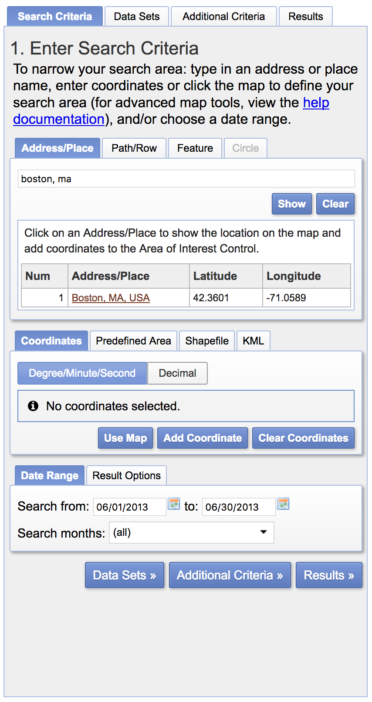
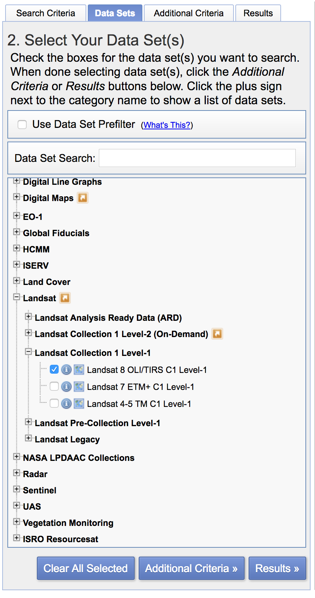
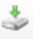

# Problem Set 4: Working With Landsat Data

*NOTE: We recommend viewing these instructions on GitHub in your web browser so that you can see the screenshots that we include below.*

## Deadline

+ PSet 4 is due *Friday, March 16 by 6PM.*

## Description

Your challenge this week is to package the functionality we were working with in the workshop into a series of functions capable of processing Landsat data. You'll then use these functions to process Landsat data you've downloaded, producing estimates of Vegetation Land Surface Temperature. Finally, you'll use the BQA band to write a filter that removes clouds and cloud shadows from our Landsat dataset.

## Deliverables

### To GitHub

1. Your Python functions, pushed to your Github week-05 submission folder. Use this markdown page as a template!

### To Stellar

**NOTE: Your compressed `tifs` should each be between 90 and 150 MB.**

1. Your NDVI `tif`, compressed into a `zip` file, with clouds filtered. Call this file `yourlastname_ndvi_imagerydate.zip` (where `imagerydate` is the date the image was captured in the format `YYYYMMDD`).
2. Your Land Surface Temperature `tif`, compressed into a `zip` file with clouds filtered. Call this file `yourlastname_lst_imagerydate.zip` (where `imagerydate` is the date the image was captured in the format `YYYYMMDD`).

## Download Landsat Data

Download one scene of summertime Landsat 8 data for Boston, MA through [Earth Explorer](https://earthexplorer.usgs.gov/) - you'll have to create an account first! This data can come from any dates after March 2013---the first period for which Landsat 8 data is available. Prior Landsat data is slightly different, which means that the code we cooked up in the class workshop will not work for Landsat data before March 2013. Your search criteria should look something like this:



Once you've decided on a date and a scene, you'll be prompted to select the data set. We want Landsat > Landsat Collection 1 Level-1 > Landsat 8 OLI/TIRS C1 Level-1. Check the box next to this data set.



Click 'Results >>'. You should see a selection of Landsat scenes that meet your search criteria. Choose one that is relatively cloud-free (you should be able to do this with simple visual inspection). Once you've chosen a scene, select the 'download options' button () and choose to download the 'Level-1 GeoTIFF Data Product'. This is going to be a big file (~900 MB); do NOT attempt to store it in your Github repository. Extract the downloaded ZIP file into a directory. Take a look and note that the data is stored in files with names much, much longer than the ones we used in class. You'll have to account for this in your script!

## Write a Python Script Using Functions to Process the Data

In class, we wrote one function to calculate the Normalized Difference Vegetation Index and one function to estimate surface emissivity.

Build on these functions, writing six other functions, using the code we used in the workshop. Note that when you're working with the downloaded Landsat data, you'll need to either...

1. Use the much longer Landsat-provided file names. I recommend doing this, as it will allow you to much more easily use these scripts across multiple Landsat scenes.
2. Rename your files, making them shorter and more... well, appealing I guess.

## Code from Class

```python
from osgeo import gdal
import matplotlib.pyplot as plt
import numpy as np
import os
%matplotlib inline

# Mac Users: If you're having issues importing GDAL,
# you may have to add GDAL to your Python path again
# sys.path.insert(0,'/Library/Frameworks/GDAL.framework/Versions/2.2/Python/3.6/site-packages')

DATA = "/Users/ehuntley/Desktop/week-05/landsat"

def process_string (st):
    """
    Parses Landsat metadata
    """
    return float(st.split(' = ')[1].strip('\n'))

def ndvi_calc(red, nir):
    """
    Calculate NDVI
    """
    return (nir - red) / (nir + red)

def emissivity_calc (pv, ndvi):
    """
    Calculates an estimate of emissivity
    """
    ndvi_dest = ndvi.copy()
    ndvi_dest[np.where(ndvi < 0)] = 0.991
    ndvi_dest[np.where((0 <= ndvi) & (ndvi < 0.2)) ] = 0.966
    ndvi_dest[np.where((0.2 <= ndvi) & (ndvi < 0.5)) ] = (0.973 * pv[np.where((0.2 <= ndvi) & (ndvi < 0.5)) ]) + (0.966 * (1 - pv[np.where((0.2 <= ndvi) & (ndvi < 0.5)) ]) + 0.005)
    ndvi_dest[np.where(ndvi >= 0.5)] = 0.973
    return ndvi_dest

def array2tif(raster_file, new_raster_file, array):
    """
    Writes 'array' to a new tif, 'new_raster_file',
    whose properties are given by a reference tif,
    here called 'raster_file.'
    """
    # Invoke the GDAL Geotiff driver
    raster = gdal.Open(raster_file)

    driver = gdal.GetDriverByName('GTiff')
    out_raster = driver.Create(new_raster_file,
                        raster.RasterXSize,
                        raster.RasterYSize,
                        1,
                        gdal.GDT_Float32)
    out_raster.SetProjection(raster.GetProjection())
    # Set transformation - same logic as above.
    out_raster.SetGeoTransform(raster.GetGeoTransform())
    # Set up a new band.
    out_band = out_raster.GetRasterBand(1)
    # Set NoData Value
    out_band.SetNoDataValue(-1)
    # Write our Numpy array to the new band!
    out_band.WriteArray(array)

```
# Your Functions!

We recommend reading carefully through the goals for all functions before starting the first function.

```python
def tif2array(location):
    """
    Should:
    1. Use gdal.open to open a connection to a file.
    2. Get band 1 of the raster
    3. Read the band as a numpy array
    4. Convert the numpy array to type 'float32'
    5. Return the numpy array.
    """

def retrieve_meta(meta_text):
    """
    Retrieve variables from the Landsat metadata *_MTL.txt file
    Should return a list of length 4.
    'meta_text' should be the location of your metadata file
    Use the process_string function we created in the workshop.
    """

def rad_calc(tirs, var_list):
    """
    Calculate Top of Atmosphere Spectral Radiance
    Note that you'll have to access the metadata variables by
    their index number in the list, instead of naming them like we did in class.
    """

def bt_calc(rad, var_list):
    """
    Calculate Brightness Temperature
    Again, you'll have to access appropriate metadata variables
    by their index number.
    """

def pv_calc(ndvi, ndvi_s, ndvi_v):
    """
    Calculate Proportional Vegetation
    """

def lst_calc(location):
    """
    Calculate Estimate of Land Surface Temperature.
    Your output should
    ---
    Note that this should take as its input ONLY the location
    of a directory in your file system. That means it will have
    to call your other functions. It should:
    1. Define necessary constants
    2. Read in appropriate tifs (using tif2array)
    3. Retrieve needed variables from metadata (retrieve_meta)
    4. Calculate ndvi, rad, bt, pv, emis using appropriate functions
    5. Calculate land surface temperature and return it.
    Your LST function may return strips of low-values around the raster...
    This is a processing artifact that you're not expected to account for.
    Nothing to worry about!
    """
```

Use these functions to generate an Normalized Difference Vegetation Index and a Land Surface Temperature Estimate for your downloaded Landsat data.

## Remove Clouds

Your Landsat data contains another band, whose filename ends with `_BQA.tif`. this is the so-called 'quality assessment band', which contains estimates of where there are clouds in our image. You'll need to read this `tif` in: try using your new `tif2array` function!

According to the [USGS Landsat documentation](https://landsat.usgs.gov/collectionqualityband), these values are where we can be highly confident that the image is clear and, additionally, where there are clouds and cloud shadows:

| Attribute               | Pixel Value                                                                                    |
|-------------------------|------------------------------------------------------------------------------------------------|
| Clear                   | 2720, 2724, 2728, 2732                                                                         |
| Cloud Confidence - High | 2800, 2804, 2808, 2812, 6896, 6900, 6904, 6908                                                 |
| Cloud Shadow - High     | 2976, 2980, 2984, 2988, 3008, 3012, 3016, 3020, 7072, 7076, 7080, 7084, 7104, 7108, 7112, 7116 |

Write a function that reclassifies an input Numpy array based on values stored in the BQA. The function should reclassify input data in such a way that pixels, *except for those that are clear* (for example, 2720), are assigned a value of `nan`. Use the `emissivity_calc` function as a model! We're doing something similar here! Your code will look like this:

```python
def cloud_filter(array, bqa):
    array_dest = array.copy()
    array_dest[np.where((bqa != <a certain value>) & (bqa != <another certain value>)) ] = 'nan'
    return array_dest
```

You should simply be able to revise the above function, making your criteria test for `bqa` values not equal to 2720, 2724, 2728, 2732.

```python
def cloud_filter(array, bqa):
    """
    Filters out clouds and cloud shadows using values of BQA.
    """
```

## Write Your Filtered Arrays as `.tifs`

You should now be able to write your NDVI and LST arrays as GeoTIFFs. For example, to write your filtered LST to a `tif` consistent with the naming convention we've requested, you would write this code (assuming you're storing your LST in a variable called `lst_filter`).

```python
tirs_path = os.path.join(DATA, 'LC08_L1TP_012031_20170716_20170727_01_T1_B10.TIF')
out_path = os.path.join(DATA, 'huntley_ndvi_20170716.tif')
array2tif(tirs_path, out_path, lst_filter)
```

The reason you have to specify the `tirs_path` is that GDAL looks to another raster file to obtain dimensions, etc. We could use any of our input rasters - the TIRS band was chosen somewhat arbitrarily.

Once you've written these, you should compress each of them into a zip file - two separate ZIP files! This is to ensure that the files come in under Stellar's file submission size limit. Name sure they are named correctly e.g., `yourlastname_ndvi_imagerydate.tif`, where `yourlastname` is your last name and `imagerydate` is the date the imagery was captured reported in the format `YYYYMMDD`.
