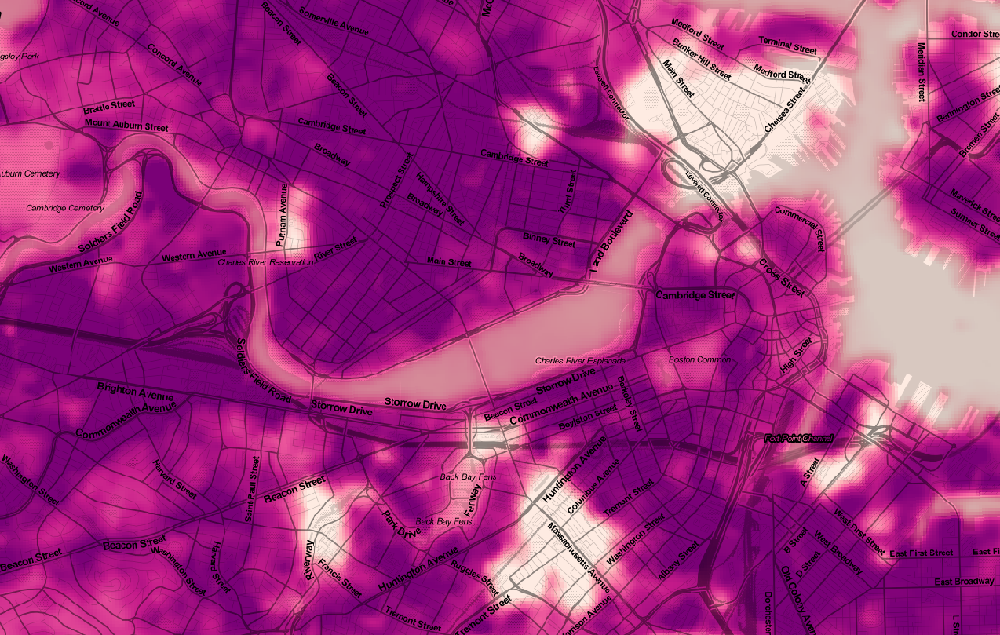
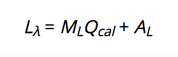
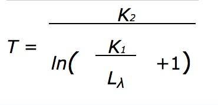
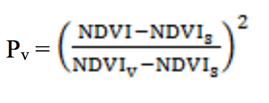
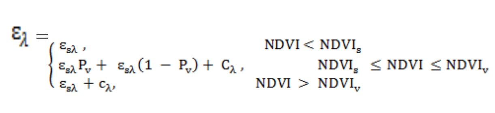
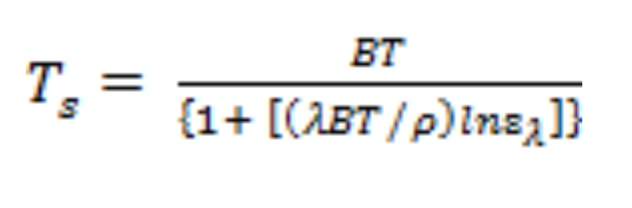

# Working With Rasters in Python: Calculating Vegetation and Land Surface Temperature



Today's agenda

+ Download Data
+ A Bit About Landsat
+ Install GDAL
+ Calculating a Normalized Difference Vegetation Index
+ Calculating an Estimate of Land Surface Temperature

## Download Data

We've included all of the data for today's workshop in a zip file located at [duspviz.mit.edu/resources/ws04_materials.zip](http://duspviz.mit.edu/resources/ws04_materials.zip). We've provided this data separately because we're trying to avoid placing our data on GitHub; we'll write code that we version using Git on files that are stored outside of our GitHub repo. This will keep us from encountering nasty issues where were prevented from pushing to GitHub because we have a file in our commit history that exceeds 25 MB.

## Landsat

Landsat is a VERY long-running Earth observation and satellite imaging program, administered jointly by NASA and the USGS (United States Geological Survey). The current satellite is Landsat 8, which was launched in 2013. Landsat measures light reflected from the Earth's surface, divided into bands; more recent iterations of the program have included Thermal sensors that measure *heat*. A complete list of these bands is as follows:

| Bands                                 | Wavelength(micrometers) | Resolution(meters) |
|---------------------------------------|-------------------------|--------------------|
| Band 1 - Ultra Blue (coastal/aerosol) | 0.435 - 0.451           | 30                 |
| Band 2 - Blue                         | 0.452 - 0.512           | 30                 |
| Band 3 - Green                        | 0.533 - 0.590           | 30                 |
| Band 4 - Red                          | 0.636 - 0.673           | 30                 |
| Band 5 - Near Infrared (NIR)          | 0.851 - 0.879           | 30                 |
| Band 6 - Shortwave Infrared (SWIR) 1  | 1.566 - 1.651           | 30                 |
| Band 7 - Shortwave Infrared (SWIR) 1  | 2.107 - 2.294           | 30                 |
| Band 8 - Panchromatic                 | 0.503 - 0.676           | 15                 |
| Band 9 - Cirrus                       | 1.363 - 1.384           | 30                 |
| Band 10 - Thermal Infrared (TIRS) 1   | 10.60 - 11.19           | 100                |
| Band 11 - Thermal Infrared (TIRS) 2   | 11.50 - 12.51           | 100                |

You can see here that each band corresponds to a different range of of radiant energy (with the exception of band 8, which contains several bands). Bands 2 - 4 correspond to portions of the visible spectrum.  

Landsat observations are made available as “scenes”; each of these scenes is approximately 183 km x 170 km and is captured every 16 days. The files we'll be working with today are relatively small extracts of a single scene - I clipped out Middlesex, Suffolk and Norfolk counties in GIS before providing the data. Remote sensing is, in many ways, the original big data! Each of the unclipped bands runs hundreds of megabytes, totaling almost 2 GB. And this is only one scene!

A remarkable amount of analysis can be done by doing basic calculations across these multiple bands.

## Install GDAL

We'll be doing our coding in Python by reading in a library called `osgeo`. However, on the back end, this Python library is powered by a spatial analysis and data management package called GDAL. We'll first have to make sure GDAL is installed on our systems.

### Mac

Mac users will install GDAL from [http://www.kyngchaos.com/software:frameworks](http://www.kyngchaos.com/software:frameworks). Select the most recent version (2.2 at the time of this writing). Install it using the default options. It will probably behoove you to restart your system after you've installed.

Once you've installed GDAL from KyngChaos, you'll have to add its location to your Python path. You'll only have to do this once. If you're using your virtual environment (again, we still recommend this), activate it first (`. ~/.venvs/bdvs/bin/activate`). Then open the Python terminal by typing `python`. Then, type the following lines:

```python
import sys
sys.path.insert(0,'/Library/Frameworks/GDAL.framework/Versions/2.2/Python/3.6/site-packages')
```

You (should) only need to do this once.

### Windows

From the command line (note: NOT Git Bash), execute either `python` or `python3`, depending on how your system is configured. Take note of the message that appears at the top: it's probably something like:

```sh
Python 3.6.4 (v3.6.4:d48eceb, Dec 19 2017, 06:04:45) [MSC v.1900 32 bit (Intel)] on win32
```

Take note of your Python version (e.g., 3.6.4) and whether you're running 32 bit or 64 bit Python. Quit the Python shell by typing `quit()`. Navigate to [Christoph Gohlke's page](https://www.lfd.uci.edu/~gohlke/pythonlibs/#gdal) and select the version of GDAL 2.2.3 that corresponds to your Python version and either 32 or 64 bit. For example, based on the message above, I would download `GDAL‑2.2.3‑cp36‑cp36m‑win32.whl` (`cp36` refers to my Python version, `win32` to the 32-bit Python).

Next, change directory to the the location to which you downloaded the `.whl` file and run:

```sh
# Replace the below file name with the appropriate one for your system
pip install GDAL‑2.2.3‑cp36‑cp36m‑win32.whl
```

Finally, run the Python shell again by typing `python` in the command line. Type `from osgeo import gdal`. If you receive no error message, you're golden! Quit the shell by typing `quit()`.

### Load Packages

Now we will start working in Atom. The top line here is new - we're importing `gdal` from the `osgeo` library, which is how Python interfaces with GDAL.

```python
from osgeo import gdal
import matplotlib.pyplot as plt
import numpy as np
import os
%matplotlib inline
## make sure you set the DATA path to be to the folder where you downloaded the data at the beginning of class
DATA = "/Users/ehuntley/Desktop/week-05/landsat"
```

## Calculating a Normalized Difference Vegetation Index

The first thing we're going to do is use the near-infrared and red bands of the Landsat imagery to calculate a simple index for estimating *how much vegetation* is present in a given raster cell; this simple index is called the Normalized Difference Vegetation Index (NDVI). We calculate it as follows:


Where NIR stands for near-infrared and red is light reflected in the red region. The rationale goes something like this: plants absorb a lot of light in the visible spectrum (i.e., red) because these are the wavelengths of light their cells use to perform photosynthesis. They reflect energy in the near-infrared region because this isn't useful to their cells - longer wavelengths carry less energy.

Okay, enough biophysics! Let's calculate the NDVI. We begin by reading in our files.

```python
red_path = os.path.join(DATA, 'b4.tif')
nir_path = os.path.join(DATA, 'b5.tif')

# Load in Red band
red_data = gdal.Open(b4_raster)
red_band = red_data.GetRasterBand(1)
red = red_band.ReadAsArray()

# Load in Near-infrasred band
nir_data = gdal.Open(b5_raster)
nir_band = nir_data.GetRasterBand(1)
nir = nir_band.ReadAsArray()
```

What we see above is `gdal` proceeding in three steps. It opens a connection to the file, obtains the raster band (all the data we'll be working with only contains band 1), and reads in a `numpy` array so that we can process it. We can see that these are `numpy` arrays by checking their type.

```python
type(nir)
```

These `red` and `nir` arrays are what we will be working with to calculate our NDVI! First, let's examine one of them by plotting it using `matplotlib`'s `imshow` (image show) function:

```python
# make sure you run these two lines at the same time or the color bar won't show up in your plot
plt.imshow(nir)
plt.colorbar()
```

This is aerial imagery conveniently cropped to the area surrounding Greater Boston. Next, let's define a function that will calculate our NDVI! Our `nir` and `red` variables are `numpy` arrays, which are vectorized; therefore we can add them, subtract them, etc. as we would the column of a `dataframe`.

```python
def ndvi_calc(red, nir):
    """ Calculate NDVI"""
    return (nir - red) / (nir + red)
```

Now let's run it!

```python
# here we are calling our function within the plot!
plt.imshow(ndvi_calc(red, nir), cmap="YlGn")
plt.colorbar()
```

Uh-oh. That doesn't look too promising... the problem is that we're trying to do math that results in non-integer values with data inputs stored as integers. We can verify this as follows:

```python
red.dtype
nir.dtype
```
`uint16` refers to an unsigned 16-bit integer. So in addition to the fact that we're doing non-integer math with integer datatypes, we're also potentially creating negative values, which doesn't work so well with an unsigned data type. Good thing we can easily convert these `numpy` arrays using the `numpy` `.astype()` method.

```python
red = red.astype(np.float32)
nir = nir.astype(np.float32)

plt.imshow(ndvi_calc(red, nir), cmap='YlGn')
plt.colorbar()
```

Better! We've just made a map of vegetated land cover using a new raster data layer derived from red and near-infrared Landsat data! Let's store the results of this function as a new variable.

```python
ndvi = ndvi_calc(red, nir)
```

**Note About Errors:** We're getting some type errors, but that's because it's dividing by null values - the function still works and will serve our purposes just fine. You may continue to get similar errors throughout the exercise. Nothing to worry about!

## Calculate Land Surface Temperature

Not only can we estimate tree cover, but we can also estimate land surface temperature using the NDVI we just estimated as one of our inputs! We'll be following the method outlined by Jeevalakshmi, Reddy, and Manikiam [here](https://www.ripublication.com/ijaer17/ijaerv12n20_57.pdf). Much of this comes directly from LANDSAT's own documentation as well. I will note when we're taking some interpretive liberties.

### Read in TIRS Band

So far, we've been working with the red and near-infrared bands. To calculate the surface temperature, we'll want to read in one of the thermal bands - these are very similar! For now, let's read in Band 10 and ensure that its stored as a floating point data type.

```python
# Path of TIRS Band
tirs_path = os.path.join(DATA, 'b10.TIF')

# Load in TIRS Band
tirs_data = gdal.Open(tirs_path)
tirs_band = tirs_data.GetRasterBand(1)
tirs = tirs_band.ReadAsArray()
tirs = tirs.astype(np.float32)
```

We now need to read in some correction values stored in the Landsat metadata in order to convert the values stored in the band to radiances. You can do this the easy (and tedious) way or the slightly harder (and automatic) way. The easy way is by opening the file and manually searching. Feel free to do this, jotting down values as you find them. We're looking for:

+ `RADIANCE_MULT_BAND_10`
+ `RADIANCE_ADD_BAND_10`
+ `K1_CONSTANT_BAND_10`
+ `K2_CONSTANT_BAND_10`

 But this sounds manual and sort of tedious... plus, we'd like to be able to replicate it over many Landsat datasets that we may download in the future. So let's look at a cooler way! We can read in the metatdata `txt` file and locate our variables of interest programmatically.

 Let's read the text file in as a Python list.

```python
# make this path the local path to your MTL.txt file that you downloaded at the start of the workshop
meta_file = '/Users/ehuntley/Desktop/week-05/landsat/MTL.txt'

with open(meta_file) as f:
    meta = f.readlines()
```

Check out the format of the `meta` list; each line of the text file is stored as an element in a list. We can then search this list for the variables of interest using list comprehension.

```python
# Define terms to match
matchers = ['RADIANCE_MULT_BAND_10', 'RADIANCE_ADD_BAND_10', 'K1_CONSTANT_BAND_10', 'K2_CONSTANT_BAND_10']

[s for s in meta if any(xs in s for xs in matchers)]
```

We see that we've returned a list containing our variables and their values in the format `    RADIANCE_MULT_BAND_10 = 3.3420E-04\n` where `\n` is a line break character. We can use two string methods to first, split the resulting string at the `=` and return what comes after the equals sign (`.split(' = ')[1]`) and second, to strip the `\n` from the end (`.strip('\n')`). We finally coerce the resulting number to a floating point data type. Let's define a function to do this:

```python
def process_string (st):
    return float(st.split(' = ')[1].strip('\n'))
```

Let's run that list comprehension again, applying our function to the results in a variable, `matching`.

```python
matching = [process_string(s) for s in meta if any(xs in s for xs in matchers)]
matching
```

Finally, we can assign each element of the list to a different variable name.

```python
rad_mult_b10, rad_add_b10, k1_b10, k2_b10 = matching
```

We now calculate a series of different derived values; we're about to play-act the role of geophysicist. Of course, much of this is simply applying other people's methods - we can look to the scientific literature to find methods and apply them to our datasets. We don't necessarily need to understand every single step... in fact, it's common that working with datasets involves applying methods without getting too bogged down in the specifics. We're just looking for an estimate of land surface temperature, not a rigorous, geoscientist-approved model (and, anyway, we can use geoscientist approved models).

Let's get started!

### Step 1: Calculate Top of Atmosphere Spectral Radiance

First, we scale the `tirs` band using the multiplicative and additive factors stored in the Landsat metadata - this produces a measured radiance at the top of the atmosphere.



Where:

+ Lλ = TOA spectral radiance (Watts/( m2 * srad * μm))
+ ML = Band-specific multiplicative rescaling factor from the metadata (e.g., `rad_mult_b10)`)
+ AL = Band-specific additive rescaling factor from the metadata (e.g., `rad_add_b10`)
+ Qcal = Quantized and calibrated standard product pixel values (e.g., `tirs`)

We have all of these values;  

```python
rad = rad_mult_b10 * tirs + rad_add_b10
plt.imshow(rad, cmap='RdYlGn')
plt.colorbar()
```

### Step 2: Calculate Brightness Temperature

We then calculate the brightness temperature at the top of the atmosphere. This is not quite temperature as we usually understand it; it is a measure of radiation. We calculate this according to the following equation:



Where:

+ T = Top of atmosphere brightness temperature (K)
+ Lλ = TOA spectral radiance (`rad`)
+ K1 = Band-specific thermal conversion constant from the metadata (`k1_b10`)
+ K2 = Band-specific thermal conversion constant from the metadata (`k2_b10`)

This also calculates the brightness temperature in degrees Kelvin, so convert by subtracting 273.15.

```python
bt = k2_b10 / np.log((k1_b10/rad) + 1) - 273.15
plt.imshow(bt, cmap='RdYlGn')
plt.colorbar()
```

### Step 3: Calculate Normalized Difference Vegetation Index

We've already done this! It should be stored in the variable `ndvi`.

```python
plt.imshow(ndvi, cmap='YlGn')
plt.colorbar()
```

### Step 4: Calculate Proportional Vegetation

We now need to produce an estimate of the proportional vegetation. We can calculate this like so:



Where:
+ NDVI = Normalized Difference Vegetation Index (`ndvi`)
+ NDVI_s = approximation of the NDVI value for unvegetated terrain (0.2)
+ NDVI_v = approximation of the NDVI value for vegetated terrain

We're going to make a bunch of assumptions here - that NDVI < 0.2 implies unvegetated terrain, that 0.2 < NDVI < 0.5 implies a mixture of vegetation and unvegetated terrain, and that NDVI > 0.5 implies nearly fully vegetated land. This is a simplifying assumption that probably wouldn't hold up to rigorous testing, but it's fine for our purposes.

```python
pv = (ndvi - 0.2) / (0.5 - 0.2) ** 2
plt.imshow(pv, cmap='RdYlGn')
plt.colorbar()
```

### Step 5: Calculate Land Surface Emissivity

We're then going to reclassify our `pv` to make it correspond to differently levels of surface emissivity - in other words, how effectively does it emit thermal radiation (heat)? We define a number of ranges: if NDVI is negative, we assume it's water, with a emissivity of 0.991. If it's between 0 and 0.2, we assume we're dealing with something with the emissivity of soil (0.991). If it's between 0.2 and 0.5, we calculate a value based on the proportion of vegetation in the cell. If it's greater than 5, we assume we're dealing with heavy vegetation and set the emissivity to an estimate of vegetation emissivity (0.973).



Where:

+ ԑλ = Land Surface Emissivity
+ P_v = Proportional Vegetation (`pv`)
+ ԑs = Estimate of soil emissivity (0.966)
+ ԑv = Estimate of vegetation emissivity (0.973)
+ C = surface roughness (we're using a value of 0.005)
+ NDVI_s = approximation of the NDVI value for unvegetated terrain (0.2)
+ NDVI_v = approximation of the NDVI value for vegetated terrain (0.5)

```python
def emissivity_calc (pv, ndvi):
    ndvi_dest = ndvi.copy()
    ndvi_dest[np.where(ndvi < 0)] = 0.991
    ndvi_dest[np.where((0 <= ndvi) & (ndvi < 0.2)) ] = 0.966
    ndvi_dest[np.where((0.2 <= ndvi) & (ndvi < 0.5)) ] = (0.973 * pv[np.where((0.2 <= ndvi) & (ndvi < 0.5)) ]) + (0.966 * (1 - pv[np.where((0.2 <= ndvi) & (ndvi < 0.5)) ]) + 0.005)
    ndvi_dest[np.where(ndvi >= 0.5)] = 0.973
    return ndvi_dest

emis = emissivity_calc(pv, ndvi)

plt.imshow(emis, cmap='RdYlGn')
plt.colorbar()
```

### Step 6: Calculate Land Surface Temperature

Finally, we calculate the Land Surface Temperature using several physical constants, our estimate of the brightness temperature at the sensor, and our estimate of land emissivity. This looks like this:



Ts = Land Surface Temperature
BT = Brightness Temperature (`bt`)
e = Emissivity (`emis`)
ρ = h * (c / σ)
σ = Boltzmann constant (1.38e-23)
c = Speed of light (2.998e8)
h = Planck's Constant (6.626e-34)

Let's first define our physical constants:

```python
wave = 10.8E-06
# PLANCK'S CONSTANT
h = 6.626e-34
# SPEED OF LIGHT
c = 2.998e8
# BOLTZMANN's CONSTANT
s = 1.38e-23
p = h * c / s
```

Let's then calculate the LST.

```python
lst = bt / (1 + (wave * bt / p) * np.log(emis))

plt.imshow(lst, cmap='RdYlGn')
plt.colorbar()
```

# Write a .tif File

Creating a new TIF file using GDAL is a bit cumbersome, but it looks a little bit like this. I've written this as a function, so all you need to provide is a path to write to (`new_raster_file`), an array to write (`array`), and the path to a file that GDAL can reference to determine raster dimensions, etc.

```python

def array2tif(raster_file, new_raster_file, array):
    """
    Writes 'array' to a new tif, 'new_raster_file',
    whose properties are given by a reference tif,
    here called 'raster_file.'
    """
    # Invoke the GDAL Geotiff driver
    raster = gdal.Open(raster_file)

    driver = gdal.GetDriverByName('GTiff')
    out_raster = driver.Create(new_raster_file,
                        raster.RasterXSize,
                        raster.RasterYSize,
                        1,
                        gdal.GDT_Float32)
    out_raster.SetProjection(raster.GetProjection())
    # Set transformation - same logic as above.
    out_raster.SetGeoTransform(raster.GetGeoTransform())
    # Set up a new band.
    out_band = out_raster.GetRasterBand(1)
    # Set NoData Value
    out_band.SetNoDataValue(-1)
    # Write our Numpy array to the new band!
    out_band.WriteArray(array)
```

Now, to export our new Land Surface Temperature estimates, all we have to do is call this function like this:

```python
out_path = os.path.join(DATA, 'lst.tif')
array2tif(tirs_path, out_path, lst)
```
