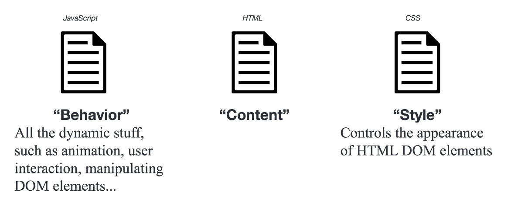

# Front End Environments: Overview of HTML/CSS/JavaScript

## Part 1: HTML/CSS

All the files you will want to use today are provided in the Week 6
folder of the class repo. The files for the website are in the **big-data** folder in your materials.

In the following steps, we are going to create a website. To do so, we'll create a blank text document, fill it with HTML code, save it as an HTML file, and view results in our browser. Through the exercise in Part 1, we will learn the concepts of HTML, style the page with CSS, and, in Part 2, add interaction using JavaScript.



Most websites are based on three core technologies: HTML, CSS, and JavaScript. HTML stands for [HyperText Markup Language](https://en.wikipedia.org/wiki/HTML); it is the lingua franca of web documents. It allows you to write structured content in a way that web browsers will understand. CSS stands for [Cascading Style Sheet](https://en.wikipedia.org/wiki/Cascading_Style_Sheets) and provides a means to style a website using structure written into the document using HTML. [Javascript](https://en.wikipedia.org/wiki/JavaScript) is the web's preferred programming language and is supported by all browsers without additional plugins. We'll be using it to build interactive visualizations and web pages. JavaScript is extended by a huge number of libraries; we'll be doing much of our data visualization work in `d3.js`.

## Getting Started

We are going to work with the website repository (`yourlastname.github.io`) we created in the first week of class.

Copy the entire **big-data** folder from the main class repo to your **username.github.io** directory. Then use terminal to **change directory** to the root of the repository (website). This is our web directory that you can access by opening a web browser (such a Chrome) and navigating to **username.github.io/big-data**.

### Organize your Directory

There are many possible ways to organize a website; we're going to be using a simple structure that follows this basic template:


When a browser requests your page, your server will return the `index.html` file in the root-directory. The `index.html` is your 'root' or 'home' page.

Note that you don't see an `index.html` in the materials. We are going to create the `index.html` page in the upcoming steps.

### Set up a Development Environment Using Python

Lest you think we left Python behind... we're going to be making use of an excellent server package included with Python. Use the Terminal to change directory (`cd`) to your `username.github.io` repository.

Once there, type the following to start a simple Python server:

```bash
python -m http.server 8080
```

You might get a message that pops up with a note about accepting incoming connections or your Firewall. This is not a problem, you can click OK.

With this running, open a web browser (i.e. Chrome) and access your site at `http://localhost:8080`. What are we doing here? `localhost` is computer-speak for 'this machine' and Python's `http.server` is letting us access a local folder as though it were hosted on a network.

This is a very basic **Development Environment**, which allows us to test content developed for the web without posting it to the public-facing internet. When you modify your local files and refresh your page in the browser, your page will appear as it would if it were live on the internet. But it isn't! Your changes (and your mistakes!) are only visible to you locally.

Once this is done, you can ignore your Python terminal and simply let it run in the background. If you want to stop the server, type `Ctrl-C`.

## HTML: The Core Concepts

Let's get started! Create a new blank text document in Atom and save it as `index.html` in your folder.

All HTML documents start with the following line of code:

```html
<!DOCTYPE html>
```

This tag inform a web browser that the rest of your file will be written using HTML.

### Elements

HTML is what's called a markup language - it provides a structure for (i.e., marks up) content. Content is organized into elements, which can then be filled with content, made interactive, and styled. HTML elements look something like this:

```html
<element attribute = "value">Content goes here!</element>
```

Where `attribute`s are properties of a given element that provide additional information regarding style, destination, source, etc.

Elements generally consist of a starting tag, a closing tag, and content. However, some elements do not require closing tags; for example, the `` element. These elements are called void elements.

```html
<element attribute = "value" />
```

### Comments

Comments are used to write human-readable notes in your code that are ignored by the browser. They are the equivalent of `#` in Python.

```html
<!-- This is a comment -->
```

A (very) basic page that contains these elements might look something like this:

```html
<!DOCTYPE html>
<html lang="en">
	<head>
    	<meta charset="utf-8">
    	<title>Hello World</title>
	</head>
	<body>
		<!-- This is a comment -->
		<h1>Hello World</h1>
		<div id="main">
			...
		</div>
	</body>
</html>
```

Copy and paste this code into a blank text document in Atom, and save it in your `yourusername.github.io` repository in the `big-data` folder as `index.html`. This will become the main page for the big-data page on your website.

Save it and view it at `http://localhost:8080/big-data`.

## The Document Object Model (DOM)

To help us organize the elements, we use something called the [Document Object Model (DOM)](https://www.w3.org/DOM/). This is how we model the hierarchy that structures the relationships between elements in our page; it also provides an interface that allows programs and scripts to dynamically access and update the content, style, and structure of the page.

For any given page this can be diagrammed using a **DOM Tree**, consisting of HTML elements.


## Basic Elements

### `head` and `body`

Within a given webpage, there are always two large elements: the `head` and the `body`. The `head` contains metadata (page titles, text encoding, etc.), while the `body` contains information that will be rendered in your webpage.

```html
<!-- HEAD element containing meta information, style, and links -->
<head>
	...
</head>
<!-- BODY element containing all document content elements -->
<body>
	...
</body>
```

### Links (`a`), Images (`img`), and Paragraphs (`p`)

```html
<!-- a is used to define a hyperlink -->
<a href="http://somesite.www">...</a>
<!-- IMAGE tag to define a link to an image in your document -->
<!-- It's a VOID ELEMENT -->

<!-- PARAGRAPH tag for large blocks of body text -->
<p>...</p>
<!-- SPAN is for groups of inline elements -->
<span>...</span>
```

### Lists (`ul`, `ol`)

[Lists](https://www.w3schools.com/html/html_lists.asp) are useful for itemized data.

```html
<!-- UL defines an unordered list -->
<ul>
	<li>...</li> <!-- line in list -->
</ul>
<!-- OL defines an ordered list -->
<ol>
	<li>...</li> <!-- line in list -->
</ol>
```

`ol` has an attribute, `type` that allows you to specify how the list items will be numbered.

Type | Description
---- | -----------
type="1" | The list items will be numbered with numbers (default)
type="A" | The list items will be numbered with uppercase letters
type="a" | The list items will be numbered with lowercase letters
type="I" | The list items will be numbered with uppercase roman numbers
type="i" | The list items will be numbered with lowercase roman numbers

## `div` Tags

One of the most common tags is the `div` tag. It can also be kind of confusing for new web developers, as it does not have a clearly defined output in the same way an `img` or an `a` element does. The `div` tag is an element of HTML that allows you to group content into containers (or divisions) you can organize and style on your web page. `div`s also play nicely with CSS (Cascading Style Sheets). CSS is a style sheet language used for describing the look and formatting of an HTML page. We will introduce it in the next step.

```html
<div id="main">
	<!-- Content goes here -->
	...
</div>
```

## Tag Attributes, Classes, and IDs

Tags are specified and defined using attributes, classes, and IDs. These attributes, classes, and IDs allow you to identify specific elements, modify individual elements and groups of elements, and set the characteristics of the elements.

+ *Attributes* characterize the properties of elements. Elements can have multiple attributes. For example, the `href` attribute of an `a` element tells the browser to which address a link should direct a user.

+ *Classes* identify a group of elements that should be styled similarly or that should work in the same fashion. For example, you may want all buttons to be styled in the same way.

+ *IDs* identify unique elements, allowing these to be styled . In each document, each ID should be unique.

For example:

```html
<a href="http://www.github.com" class="button" id="unique">...</tag>
```

or...


```html
<div style="background-color:#0000FF" class="header" id="main">...</div>
```

## Modify your Document

Let's get into the document a bit.

### Add Text

Our HTML document is looking bare, we need to add content. We can start by modifying the heading that welcomes visitors to our site and add a couple paragraph elements.

Modify the HTML code on the page to include the following. Add some paragraph `p` elements within the `div` element of your page. It's common for web designers to use placeholder text while the content of a given website is still coming together; frequently, this placeholder text is so-called [Lorem Ipsum](https://lipsum.com/), nonsense Latin that has been commonplace in the publishing industry since the 1960s. (If you're curious, it's a [chopped and screwed](https://en.wikipedia.org/wiki/Chopped_and_screwed) section of *De finibus bonorum et malorum* by Cicero.)

```html
<h1 id="headtext">Body Heading</h1>
<p class="my_paragraphs" id="foo">This is my first paragraph.</p>
<p class="my_paragraphs" id="bar">This is my second paragraph.</p>
```

The `h1` tag signifies a heading; headings are bolded text that varies in size, ranging from `h1` (largest) to `h6` (smallest). The `p` tag signifies a paragraph that can contain large blocks of text. To view a full list of elements available, view the [MDN Element Reference](https://developer.mozilla.org/en-US/docs/Web/HTML/Element).

### Add a Link

Adding a link to your site is simple. To add a link, we use the `a` tag, with the `href` attribute. Write the following line of code at the end your second paragraph, just before the `p` end tag.

```html
<a href="http://dusp.mit.edu">Take me to DUSP.</a>
```

You have many options for links. [Read about them here](http://www.w3schools.com/tags/tag_a.asp). For example, if you want a link to open in a new tab, you can use `target = "_blank"` as a property of the `a` tag.

### Add an Image

Adding an image is just as easy as adding a hyperlink, although a bit different. When you display an image in an html file, you must link to the image. The HTML tells the browser to locate and display it.

+ Locate the folder named `images` that you copied to your web directory. You will find one image here named `cat.jpg`. Here you store all subsequent images you want to use in your page.
+ Use the `img` tag to link to that image in your `index.html`.


Now we can add the image to our index.html. The following line of code uses the `img` tag, and then links to our image. We will use the `src =` attribute to name the source of the image. The image is coming from our own server, we don't need to go externally to get it, so we can put the name of the folder and image as our image address.

Copy and paste this following line in between the `body` tags in your `index.html`, after your last paragraph.

If you want to add an image from another page, you can simply include the URL at which the image is located. The following links to an image on Wikimedia.

```html

```

## Our Code

At present, your document should look something like the following:

```html
<!DOCTYPE html>
<html lang="en">
	<head>
    	<meta charset="utf-8">
    	<title>Hello World</title>
	</head>
	<body>
		<!-- This is a comment -->
		<h1>Hello World</h1>
		<div id="main">
			<p class="my_paragraphs" id="foo">This is my first paragraph.</p>
			<p class="my_paragraphs" id="bar">This is my second paragraph. <a href="http://dusp.mit.edu">Take me to DUSP.</a></p>
			
			
		</div>
	</body>
</html>
```

* [MDN HTML Element Reference](https://developer.mozilla.org/en-US/docs/Web/HTML/Element)
* [MDN HTML Attribute Reference](https://developer.mozilla.org/en-US/docs/Web/HTML/Attributes)

Our page is a little dull though, let's start with some styling.

## CSS: The Core Concepts

### Cascading Style Sheets

Cascading Style Sheets (CSS) is a  language used for describing the look and formatting of the elements in an HTML page. It uses the DOM as the way it interfaces with the elements, and styles 'cascade' from higher elements in the DOM tree to elements further down. CSS is a very useful styling system, and allows you to style items on your page according to a number of methods based on the element it falls within (e.g., `div`, `body`, `p`), the id of the element (e.g., `#main`, `#myimg`), or the class of the element (e.g., `.button`, `nav`).

### Cascading?

The language 'cascades' in that if you style an element, any nested elements will get the same styling unless you specify otherwise. For example, if you set the font for your `body` element, a `p` within the body will also be set to the same font... that is, unless you specify specifically in the CSS that you want that p to have another font. This is a useful in that is minimizes the code you need to write. It also forces you to be careful with your page organization.

### Link a CSS File to your Site

CSS can be added to style your website in one of a few ways. You can apply CSS to individual elements, embed it within your HTML document, or create a separate CSS file and link it to your HTML doc. In your file, add the following link in `head` section of your document.

```html
<link href="css/main.css" rel="stylesheet" />
```

Save your document, and refresh your page. Everything should now be center-aligned. This is because we applied CSS code to our document by linking our style file.

In the materials for this week, locate the file 'main.css'. This is our stylesheet; open it in your text editor to view the contents. It is a very simple bit of CSS that tells everything in the `body` element to center in the page.

```css
body {
	text-align: center;
}
```

All content in the `body` tag are now in the center of the page.

#### Basic Syntax

Basic CSS syntax looks like the following.

```css
[selector] {
	[property]: [value];
}
```

Selectors are page elements, and can be tags, ids, titles, classes, etc. For example, if we want to style everything that falls in the `body` tag, we use the `body` selector as above.

Selectors can be specified by element:

```css
p {
	font-size: 12;
}
```

To specify a selector by class, we use the `.` character:

```css
.my_paragraphs {
	background-color: #1d1230;
}
```

This will change the background color of all elements with the class `my-paragraphs` (i.e., `<p class = "my_paragraphs">`). Note, though, that these don't necessarily have to be `p`s. They could be any element of the class `my_paragraphs`.

To specify a selector by ID, we use the `#` character:

```css
#foo {
	color: #ff0000;
}

#bar {
	color: white;
	background-color: red;
}
```

The above two commands will change the text color for elements with `id="foo"` and `id="bar"`.

### Inheritance and Order of Operations

CSS follows the DOM model, with styles applied to elements higher in the DOM applied to those that are descendants. If selectors are defined in multiple locations in your CSS, which one gets precedence?


There are two general rules of thumb.

* CSS defined last in your document will supersede CSS set on a selector earlier in your document.
* The more specific selector will override the less specific selector. For example, a style set on the body selector will be overridden by a style set on an element within the body, such as one by ID.

### Properties and Values

There are hundreds of properties you can set using CSS. Some of these include font, color, location on page, opacity, size, etc. An extensive list can be found in CSS reference documents. Two prominent references are by W3Schools and Mozilla, check them out for further reading.

* [MDN CSS General Reference](https://developer.mozilla.org/en-US/docs/Web/CSS/Reference)
* [MDN CSS Common Properties Reference](https://developer.mozilla.org/en-US/docs/Web/CSS/CSS_Properties_Reference)

### Styling Type

To change the font for all of our document, we change it on the highest level we can by signifying we want to style everything within the html tag. This can be accomplished by adding the following selector and properties to the stylesheet. Because this is modifying the HTML tag, it will be a very general application of style. To help keep us organized, put this at the top of the document!

```css
html {
  font-family: Helvetica, sans-serif;
  font-size: 24px;
  line-height: 32px;
}
```

Font family prioritizes a list of font names for the selected element. Line height specifies the minimal height of line boxes within the element.

### Change Font Color

Colors can specified using hex, RGB, or a set of [preset supported color names](http://www.w3schools.com/colors/colors_names.asp). In other words, the following three examples set the text color to red:

```css
#foo {
	color: #ff0000;
}
#foo {
	color: rgb(255, 0, 0);
}
#foo {
	color: red;
}
```

### Change Background Color

Adjust the color of an element using background color.

```css
.my_paragraphs {
	background-color: #1d1230;
}
```

### Pseudo-Classes and Changing Link Color

In CSS, elements have what are called [Pseudo-Classes](https://developer.mozilla.org/en-US/docs/Web/CSS/Pseudo-classes). Pseudo-classes are keywords added to selectors that specifies a special state of the element to be selected. We signify a pseudo-class using a `:` For example, one pseudo-class is `:hover`, and it signifies what happens you hover over an element. This can be used to change the color a link turns when you hover over it.

```css
a:hover {
  color: orange;
}
```

### Chaining

To find selectors that are nested within other selectors, you can use chaining. Chaining is how we identify multiple ids, classes, and selectors. The following will select links within elements of class `my_paragraphs`.

```css
.my_paragraphs a {
  font-size: 18px;
}
```

[Read more about it here.](https://css-tricks.com/multiple-class-id-selectors/)

### Developer Tools (Chrome/Firefox)

Modern web browsers have powerful developer tools that let you manipulate and interface with webpages you have navigated to. This is a really handy tool for testing out CSS changes and modifying properties, or just seeing if the page you are working on is operating correctly.

To access them, right click on an element in the page, and select **Inspect Element**.

A window will pop up in your browser, and you can edit the code!

**Fun Task** - Go edit the headlines on NY Times, and change up the fonts, sizes, and colors.

### The Box Model: Size and Positioning

Every element in your document is represented by a box. These boxes allow you to set properties such as margins around items.  You can check out the box model in the Developer tools.


* **Padding** - The content is surrounded by the padding area, exists between the content and the border.

* **Border** - Every box has a border that exists on the outer edge of the padding area.

* **Margin** - Margin defines the distance between the element and neighboring elements. Margin never has color.

* **Dimensions** - Controls the height and width of the elements.

You can also adjust the margins, padding, and border individually on each side of the element. And example element, along with its styling, is below. Add this to your CSS stylesheet and save to see how it changes our basic webpage.

```css
p {
    padding: 20px;
    width: 320px;
    height: 40px;
    margin-left: 50px;
}
```

#### Positioning

Positioning your element can be one of the trickier parts of working with CSS. There are a couple of ways you can position items.

Value | Description
----- | -----------
static | Default value. Elements render in order, as they appear in the document flow
absolute | The element is positioned relative to its first positioned (not static) ancestor element
fixed | The element is positioned relative to the browser window
relative | The element is positioned relative to its normal position, so "left:20px" adds 20 pixels to the element's LEFT position
initial | Sets this property to its default value. Read about initial
inherit | Inherits this property from its parent element.

Another available property is called is **float**. Float can be used to wrap text around images.

```css
#bar {
    float: right;
}
```

CSS is the way you style your page, learn more by referring to the references, or playing around in a sandbox such as [CSS Desk](http://www.cssdesk.com/).

For your reference, here are some CSS resources.

* [MDN CSS General Reference](https://developer.mozilla.org/en-US/docs/Web/CSS/Reference)
* [MDN CSS Common Properties Reference](https://developer.mozilla.org/en-US/docs/Web/CSS/CSS_Properties_Reference)
