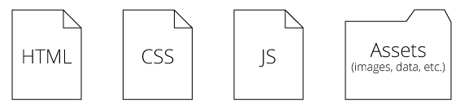
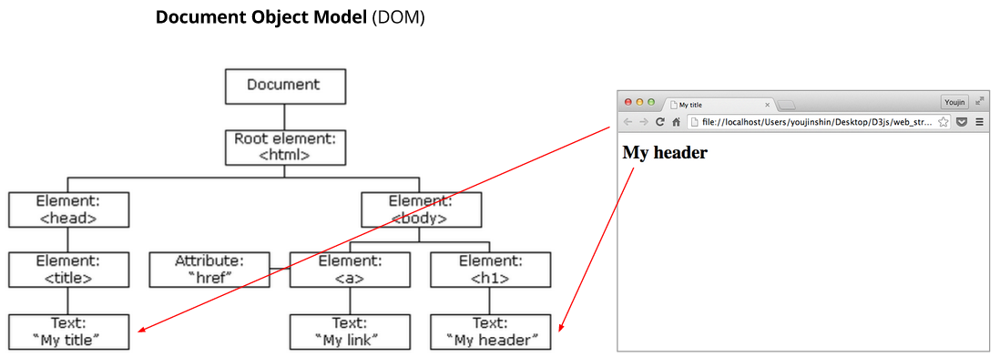
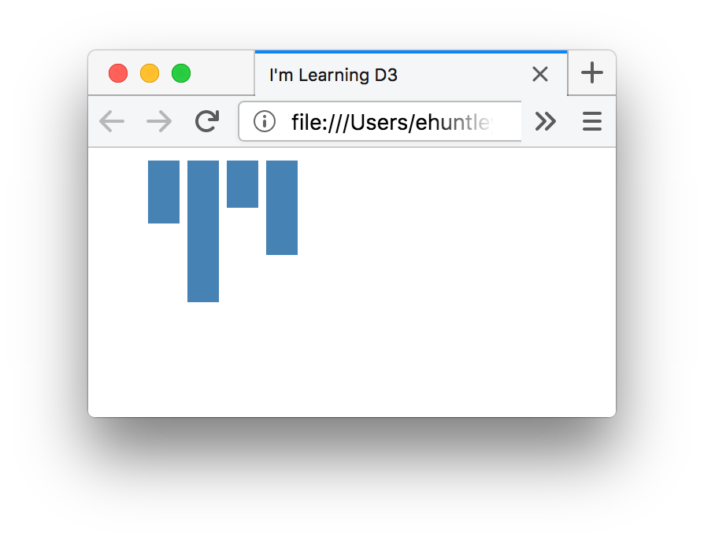
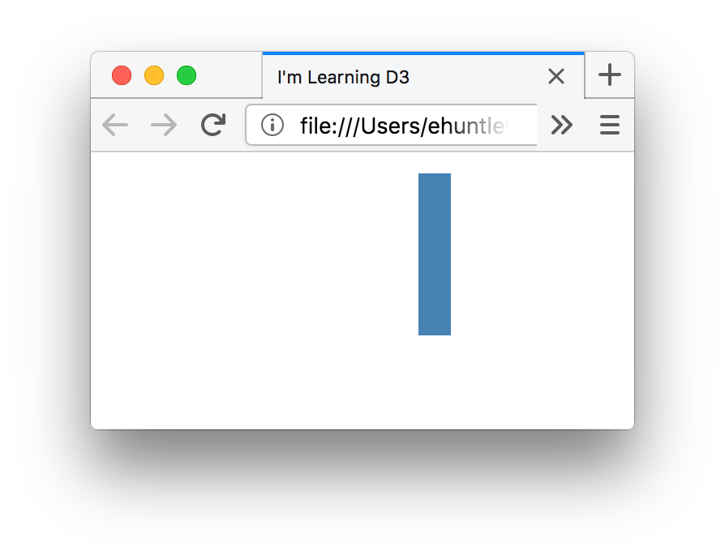
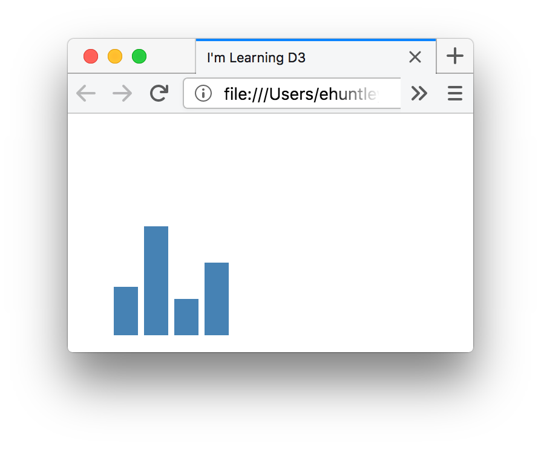
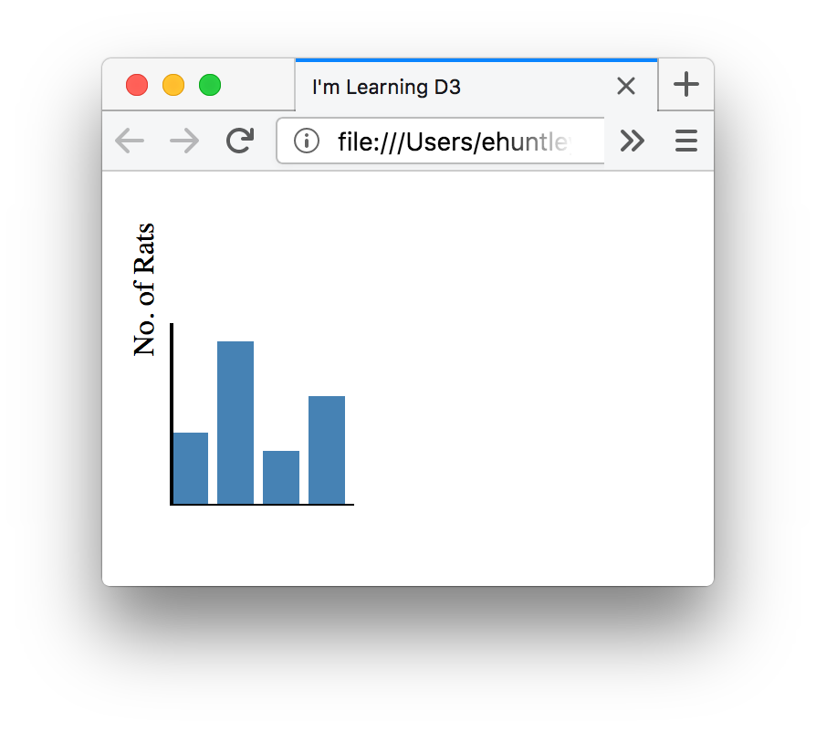
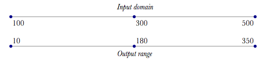
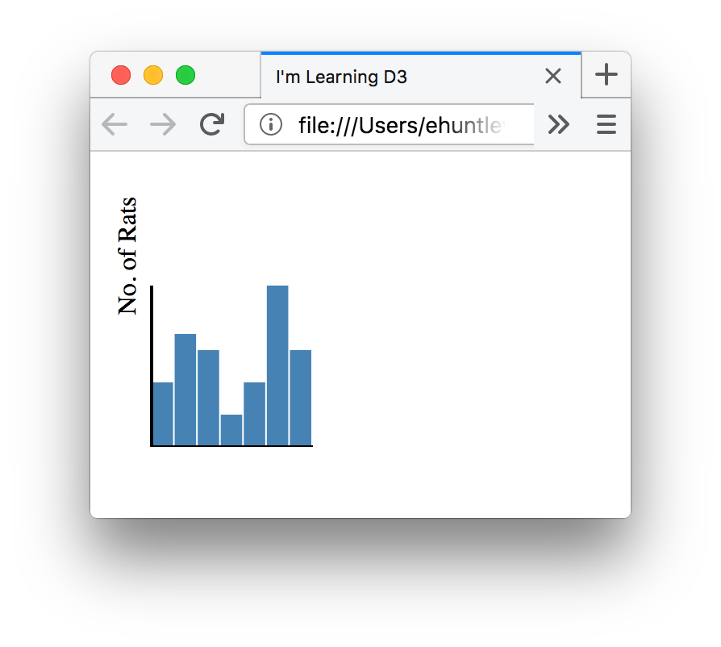
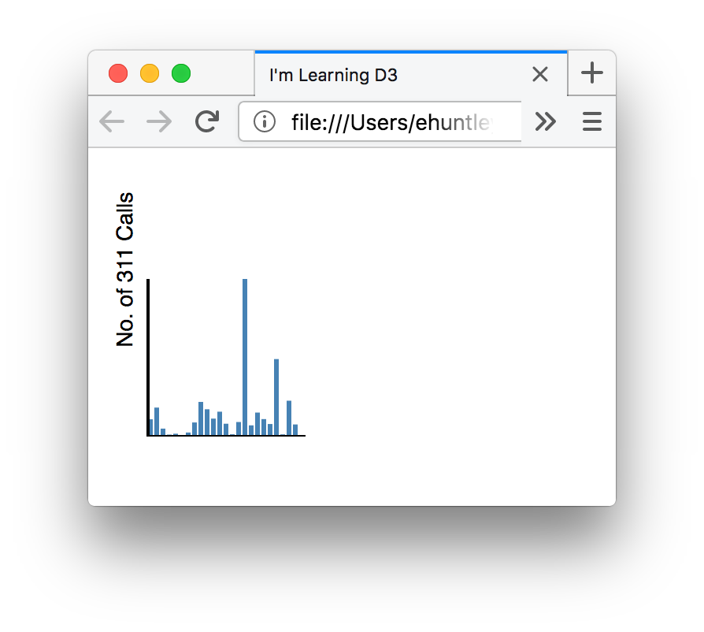
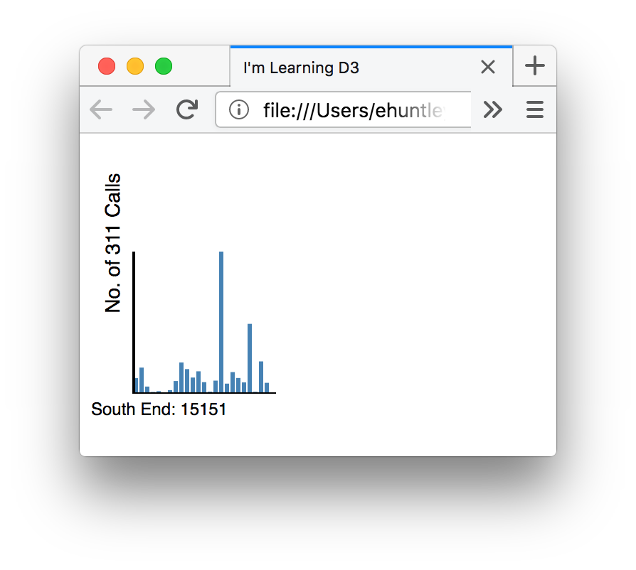

# Introduction to D3 - Make a Chart

Session Objectives

- Learn the fundamentals of D3 and Scaleable Vector Graphics (SVG).
- Understand how D3 binds a data value to a page element.

## What is D3?

D3 stands for [Data Driven Documents](http://d3js.org/). It is a
JavaScript library developed by [Mike
Bostock](https://twitter.com/mbostock) that is designed to manipulate
documents based on data, allowing the user to create rich and dynamic
visualizations using web standards of HTML, SVG, CSS, and JavaScript.
The library is well developed, and very popular among Data Scientists and
Graphics Developers.

It is perhaps easier to describe D3 by detailing what it is not. You've probably
come across standard plotting libraries; `ggplot2` or `shiny` for R, Excel's
built-in plotting functions, `matplotlib` in Python... these are libraries that
make it easy to do *particular kinds of plotting*. They will have built-in functions
to make producing certain kind of graphics very simple. Generating a complete bar
chart might require only one line of code, or the click of one button.

This is not the case in D3. D3 is output-neutral; this means that every graphic requires
quite a bit of explicit coding to give direction to our web browser. On the one hand,
this means that producing even simple graphics will at first seem very laborious. On
the other hand, because D3 is not prescriptive, you can quite literally do anything with it.
Where dedicated plotting and mapping libraries break down quite quickly when you want to
do something other than what they're intended to do, D3 will have no complaint when you try to push
at the edges.

Think of it as a very fancy tool that you have to learn to operate, telling it what to draw, what data to base the drawing on, and which document to manipulate.

## Web Page Documents and Assets

To describe how D3 works, first consider what we mean by the term
**Documents**. A webpage is a collection of documents sitting on your
web server. The web server has an address on the World Wide Web that
other computers can navigate to. When a visitor navigates to your
address, their browser will request one or more documents. These
documents describe to their browser what to display, how to display it,
where to get data from that aids in the display, and when to execute
events such as user clicks. A basic webpage could contain a series of
text documents that contain code written to structure the webpage
(HTML), style that page (CSS), and add dynamic elements (JS). Webpages
will often have many assets, including images, data, and other
supplemental material that makes the page display and function
properly.



## How D3 Works

When working with D3, you are creating and manipulating *elements* within web documents. For example, the D3 JavaScript library will find a `div`element in your page, bind a dataset to it, then set attributes of that
element according to values in the dataset. It might dynamically update the element
based on, for example, a user click or a change in the dataset.

D3 is, indeed, data-driven; this means that changes on your web page are generated by data that you are expected to 'bind'. D3 can work with just about any element found on your webpage and modify it
by binding data to that element and setting attributes of that element
accordingly. **The data drives the document.** For example, D3 can be
used to generate an HTML table from an array of numbers, or you can use
the same data to create an interactive bar chart those same numbers.
Events you connect to these elements allow for interaction with the
data[^1^](#citation1).

Just what does this mean? Take a look at a sample dataset. D3 allows
these data to be attached to elements in our document.

| City       | # of Rats |
|------------|-----------|
| Brookline  | 40        |
| Boston     | 90        |
| Cambridge  | 30        |
| Somerville | 60        |

The primary element you will find yourself working with is the SVG, or
the [Scalable Vector
Graphic](https://en.wikipedia.org/wiki/Scalable_Vector_Graphics). SVG
is an XML-based, web-friendly vector image format. It also
provides support for animation and interactivity. SVG is unique in that
all of the behaviors and components of the SVG images can be accessed
from JavaScript and CSS just like any other element in a webpage.


## Let’s Get Started!

In this exercise, you will create a webpage and display a chart that
will help explain what we mean by driving a document with data. The next
steps will set up an environment, create a basic webpage with some
graphic elements, and show how you can use the D3 JavaScript library to
connect data to some SVG elements on your page.

<!-- ##### Dynamic Bar Chart with Tooltips and Axes [(Click to view this example on its own.)](http://duspviz.mit.edu/d3-workshop/examples/session1/d3_chart1_example.html/)\
*Hover over bars to see data* -->

### Download Docs and Set Up your Development Environment

In order to work with D3, we have to serve the page your visualization
is on to the web. To do so, open terminal, change directory to where you
have saved the files (down to the folder called 'd3_part1_barcharts'), and start up a simple Python server using:

```python
python -m http.server
```

Remember that you can now access this file through the browser by typing **http://localhost:8000** into the browser bar. Then, navigate in the browser to **barchart-completed.html**, and you
can view the completed code for the first example. We are going to start
from scratch to show you how to draw SVG!

### Set up HTML Boilerplate

To get start, create an empty text document in your web folder. In that
document, copy and paste the following. This is some basic boilerplate
HTML, with a head and body which we can fill with content.

```html
<!DOCTYPE html>
<html lang="en">
<head>
	<title>I'm Learning D3</title>
	<!-- You will load the D3 library here. -->
</head>
<body>
	<!-- Page elements and content go here. -->
	<script>
		<!-- Our D3 code will go here. -->
	</script>
</body>
</html>
```

Save this document as **chart.html** in your web folder. There is no
content here yet, just a boilerplate template. We will work in this
document for the exercise.

### Hardcode a Simple Dataset into SVG Elements

As mentioned, D3 operates with a goal of binding data to elements on our
page. The following step illustrates what this would look like without
D3, and will give you a nice picture of what exactly we are going to be
addressing by using the D3 JavaScript library to connect data to our
page elements. For illustration, lets say we have a dataset with the
following values.

**(40, 90, 30, 60)**

We want a bar chart, with the height of each bar as the respective value
in the dataset. (i.e. The first bar has a height of 40 pixels, etc.) In
the following block of code, copy and paste the SVG elements
highlighted in the block below into your code.

```html

<!DOCTYPE html>
<html lang="en">
<head>
	<title>I'm Learning D3</title>
	<!-- You will load the D3 library here. -->
</head>
<body>
	<!-- Page elements and content go here. -->
	<svg width="160" height="180">
		<rect x="30" width="20" height="40" fill="steelblue"></rect>
		<rect x="55" width="20" height="90" fill="steelblue"></rect>
		<rect x="80" width="20" height="30" fill="steelblue"></rect>
		<rect x="105" width="20" height="60" fill="steelblue"></rect>
	</svg>
	<script>
	<!-- Our D3 code will go here. -->
	</script>

</body>
</html>
```

Save your document and open up your page in a web browser. You will see
the elements on the page at the top, justified to the top, with height
set accordingly to our hardcoded dataset.


This is very basic, but we have begun to locate items on our screen.
This is the first step towards a nice visualization. We can build from
here, and show how we can use D3 to make this a robust, dynamic chart in
which we can load data.

### Working with Scaleable Vector Graphics (SVG)

One of the primary element types you will manipulate using D3 are
Scaleable Vector Graphics, or SVG. These are page elements that can sit
right within the body of your page and can be manipulated like any other
element in the Document Object Model. The following shows the layout of
three rectangles in the DOM, and how they will appear in our browser.


Note that **0,0** is in the upper left corner of the SVG element, and
all child elements are located in relation to this parent element.

For more on SVG, its capabilities and available elements, [check out the
documentation.](https://developer.mozilla.org/en-US/docs/Web/SVG)

### Working with the Document Object Model

Working with D3, you will become very familiar with the Document Object
Model, often shorted to just “The DOM”. The DOM is highly functional,
and as a model it provides the path for your browser to interact with a
webpage. It is a fully object-oriented representation of the webpage,
organized as a structured group of nodes, elements, and objects. Each
element of the page, including the paragraphs, headings, divs, styles,
etc. can be accessed and modified. Think of it as a structured breakdown
the elements of a web page that can be traced for easy interaction and
manipulation, and also as the space in which the elements exist when you
interact with them.



The body of your page is an element, and under it are paragraph elements
and headers. Typically, an SVG element used in D3 sits nested within
the `body` element in the DOM.

For more on working with the DOM, and what exactly this means, [check
out the
documentation.](https://developer.mozilla.org/en-US/docs/Web/API/Document_Object_Model)

### Connect Data to the SVG Elements Using D3

There are limitations to hard coding the data to an element. It can be
hard to create, tedious to update or modify, and is not expandable. This
is where D3 steps in. D3 will allow us easy access to these elements, we
can use D3 to give the height to the element.

Let's modify our code block to include the D3 library, and then embed the data
into the JavaScript tag in the body. Observe the block of code below.
Note that we remove the height attribute for the SVG rectangles, we will
use D3 to create and define the height attribute.

```html
<!DOCTYPE html>
<html lang="en">
<head>
	<title>I'm Learning D3</title>
	<!-- Load the D3 library here -->
	<script src="https://d3js.org/d3.v4.js" charset="utf-8"></script>
</head>
<body>
	<!-- Page elements and content go here. -->
	<svg width="160" height="180">
		<rect x="30" width="20" fill="steelblue"></rect>
		<rect x="55" width="20" fill="steelblue"></rect>
		<rect x="80" width="20" fill="steelblue"></rect>
		<rect x="105" width="20" fill="steelblue"></rect>
	</svg>
	<script>
		var ratData = [ 40, 90, 30, 60 ];

		d3.selectAll( "rect" )
			.data( ratData )
			.attr( "height", function(d){
				return d;
			});
	</script>

</body>
</html>
```

Save your document and open up your page in a web browser. You will see
the elements on the page at the top, justified to the top.



### So, what happened here?

Look between the **script** tags in our code. In line 18, we created a
simple array of data containing our dataset. These numbers are what we
want to show using the height of each of the rectangle elements. This is
measured in pixels.

```js
var ratData = [ 40, 90, 30, 60 ];
```

Next, we use a D3 selection to select all of the rectangle objects
(`rect`) in the document. We do this using
[selectAll()](https://github.com/mbostock/d3/wiki/Selections#d3_selectAll).

### Working with Selections

A D3 selection is an array of elements from the current document and
follows the same guidelines as CSS. The selection process lets D3 select
elements from the document so that operators can be to the elements,
telling them to do stuff. D3 has
[select()](https://github.com/mbostock/d3/wiki/Selections#d3_select) and
[selectAll()](https://github.com/mbostock/d3/wiki/Selections#d3_selectAll)
methods to find single or multiple
[DOM](https://developer.mozilla.org/en-US/docs/Web/API/Document_Object_Model)
elements, respectively. This works much like [jQuery](jquery.com).

```js
d3.selectAll( "rect" ); // select all SVG rect elements
d3.select( "#boston" ); // select an element where id='boston'
d3.selectAll( ".bar" ); // select all elements with the class 'bar'
```

Since `selectAll("rect")` finds multiple elements, everything in the
chain following this will be happening to each of those
elements. Using this will iterate through each of the
elements on the page that we are binding data to.

#### SelectAll Iteration

The `selectAll` method iterates through the data values one by one.
Going one by one, data values are returned to the DOM. This ultimately
allows for functions and operations to be performed on each data value.
The order, unless specified in another way, will be from top to bottom
down you page.

The selector, in our code looks like the following:

```js
d3.selectAll( "rect" )
    .data( ratData )
    .attr( "height", function(d){
        return d;
    });
```

In pseudo code, this selects all `rect` elements, passes the variable
`ratData` to the `rect` elements (`ratData` contains an array), then
sets the attribute of **height** to the values in the `ratData` array.
The elements will be selected and data from the array will be applied in
**document traversal order** (top-to-bottom). When you run out of
elements or data, the return is empty.

+ For more on working with selections and the options available, [check
out the documentation.](https://github.com/mbostock/d3/wiki/Selections#d3_selectAll)
+ Additional recommended reading on selections from Mike Bostock [How
Selections Work](https://bost.ocks.org/mike/selection/)

#### The data() method

The [data()](https://github.com/mbostock/d3/wiki/Selections#data) method
is the very soul of D3. With it, an array of data is bound to page
elements.

#### The attr() method

The [attr()](https://github.com/mbostock/d3/wiki/Selections#attr) method
allows us to set attributes of the page elements. In this example, we
set the height attribute.

#### Anonymous Functions

In our code we set height to an anonymous function. These can be a bit confusing, so let's dig into what this means.

```js
.attr( "height", function(d){
    return d;
});
```

The argument **d** that is being passed to the function represents our
dataset. The anonymous function has a parameter for the data values you
just bound to your page elements in the **data** statement. This is
built into D3. The name of this variable (**d**) is arbitrary, but d is
usually used as it represents a data value.

You can use **console.log(d);** to see the values held by **d** printed
to the console in your browser.

```js
.attr( "height", function(d){
    console.log(d);
    return d;
});
```

This code prints the following to the console.


Change the variable value to **a** and view the result.

```js
.attr( "height", function(a){
    console.log(a);
    return a;
});
```


The data you bind to your page elements is an object in itself. In this
example, d is our object that can be operated on locally within this
function. If our data object has properties, you can refer to these
properties in this step. For example, if our dataset is a JSON, with two
properties, number of rats (*number*) and city *city*), we can reference
it as we would in any other JavaScript object. i.e. `d.number`. We
will look at this more in a bit!

## Arrow Functions

While we'll be using the above syntax to work with anonymous functions in D3,
it's worth noting that there is another way which is slightly more concise - this
is the arrow function. Using arrow functions, we can write:

```js
.attr( "height", d => d);
```
Which is syntactically equivalent to:

```js
.attr( "height", function(d){
    return d;
});
```

Cool! But for now, let's stick with the more verbose syntax as it is slightly more
standard.

## Use D3 to Read Data and Create Elements from Data

It’s more often the case that you don’t have your data-driven elements
pre-baked into the page, but rather create them on the fly. Let’s give
that a try. Save your current document, and let’s **start with a new
empty HTML page.** Save this new HTML page in the same folder as the HTML file we were just working on. Again, here is the boilerplate, with the D3 library loaded.
Note we don’t create any SVG elements by hand, we are going to use the
capabilities of the D3 library to create these.

```html
<!DOCTYPE html>
<html lang="en">
<head>
	<title>I'm Learning D3</title>
	<script src="https://d3js.org/d3.v4.js" charset="utf-8"></script>
</head>
<body>
	<!-- Location for page elements. -->
	<script>
		// Our D3 code will go here.
	</script>
</body>
</html>
```

### Working within the Script Tags… let’s create our chart

Locate the **script** section of our page, here is where all of our D3
script will go.

### Add the Data

First things first, add the data. We are going to use the same (very simple)
dataset.

```js
  // Our D3 code will go here.
var ratData = [ 40, 90, 30, 60 ]; // Rat data!
```

### Create `svg` Element

Next, we are going to create the SVG element. Decide on the width
and height of the SVG, set those numbers as variables. For the chart,
let’s use a width of 150 pixels, and a height of 175 pixels. We’ll carry
this through our examples. After that, we want to create the SVG
element. The
[append()](https://github.com/mbostock/d3/wiki/Selections#append) method
creates a new element as a child of each element in the current
selection, then the
[attr()](https://github.com/mbostock/d3/wiki/Selections#attr) method
will be used to set the height and width of the SVG element. The
highlighted code below will create our SVG as a child of the body
element, and give it height and weight attributes.

```js
// Our D3 code will go here.
var ratData = [ 40, 90, 30, 60 ]; // Rat data!

// Width and height of SVG
var w = 150;
var h = 175;

//Create SVG element
var svg = d3.select("body")
    .append("svg")
    .attr("width", w)
    .attr("height", h);
```

### Create `rect` Elements


The next step is create the `rect` elements, bind the data to
them, and place them on the screen. Do this with the following code.

```js
// Our D3 code will go here.
var ratData = [ 40, 90, 30, 60 ]; // Rat data!

// Width and height of SVG
var w = 150;
var h = 175;

//Create SVG element
var svg = d3.select("body")
    .append("svg")
    .attr("width", w)
    .attr("height", h);

// Select and generate rectangle elements
svg.selectAll( "rect" )
    .data( ratData )
    .enter()
    .append("rect")
    .attr( "x", 30 )
    .attr( "y", 0 )
    .attr( "width", 20 )
    .attr( "height", 100 )
    .attr( "fill", "steelblue");
```

Things just got a little weird. **Did we just select a bunch of
rectangle elements that don’t exist?** Well, yes… kinda. With D3, you
always have to first select what you are going to be operating
on, even if it doesn’t yet exist. This is a bit
abstract, but hang with me, the next steps will explain this more.

What we did is select a bunch of rectangles that are not there, so we
get an empty selection. The next few lines of code in our block above
create these elements by binding data, defining an `enter()` behavior, and
appending a new element.

1. `data()` - We bind the data to our empty selection using the [`data()`](https://github.com/mbostock/d3/wiki/Selections#data) method, it will return the four data values in our dataset.
2. `enter()` - When we load data, it will iterate through the dataset and apply all methods that follow to each of the values of our dataset. The [`enter()`](https://github.com/mbostock/d3/wiki/Selections#enter) method creates placeholders for each data element for which no corresponding DOM element was found. Because it iterates, it will create four placeholders.
3. `append()` - Finally, the [`append(“rect”)`](https://github.com/mbostock/d3/wiki/Selections#append) method will insert a rectangle into each of the placeholders that do not have a “rect” element, which is all of them.
4. `attr()` - Iteratively sets attributes, such as (x,y) location, width, and height for each of the rectangle elements. Right now, these are all in the same location **(0,0)** and have the same width **(20)** and height **(100)**. We need to use functions to make this work properly, and will detail that next.

Save and refresh your document. You should see this… pretty boring, but
if you see this it is working! You have four rectangles, but they are
all in the same location.



### Working with the Enter and Exit methods

The `enter()` and `exit()` methods deal with new elements and unused
elements, respectively, based on incoming data. It's worth taking a minute to fully grasp these!

The `enter()` method tells D3 what to do when there are more elements in a data array than there are elements in the selection. So if you have 12 rows in an input dataset but only 8 `rect` elements when the `enter()` method is invoked, D3 will go to what follows the `enter()` method to determine what to do. Usually, the enter function will be used to create (`append()`) new elements to a given visualization. The `exit()` method tells D3 what to do when there are more elements in a data array than there are elements in a selection. Usually, this will be used to clear elements that are no longer needed. You can think of these like the 'go' and 'stop' methods, where `enter()` is the former and `exit()` is the latter.

### Styling the `rect` Elements

Finally, we properly size and arrange the `rect` elements. To do
this, we can modify the `height` attribute and `x` and `y` attributes for each
of our rectangle elements. The attributes can read functions that allow
us to dynamically change attributes based on the data value of the
current iteration.

So, let's update the attributes to properly display the “rect” elements by
changing the `x` attribute and `height` attribute. This will look
familiar! It is exactly how we assigned a height in the previous
example.

```js
// Our D3 code will go here.
var ratData = [ 40, 90, 30, 60 ]; // Rat data!

// Width and height of SVG
var w = 150;
var h = 175;

//Create SVG element
var svg = d3.select("body")
    .append("svg")
    .attr("width", w)
    .attr("height", h);

// Select and generate rectangle elements
svg.selectAll( "rect" )
    .data( ratData )
    .enter()
    .append("rect")
    .attr( "x", function(d,i){
        return i*25 + 30; // Set x coordinate of rectangle to index of data value (i)*25.
        // Add 30 to account for our left margin.
    })
    .attr( "y", 0 )
    .attr( "width", 20 )
    .attr( "height", function(d){
        return d; // Set height of rectangle to data value
    })
    .attr( "fill", "steelblue");
```

#### Setting the x attribute

You notice here a second argument is provided to our anonymous function
(**i**). This represents the index location of the data value referred to
in the **d** argument.

Here we space the bars horizontally using the
second i argument. The i argument is the index of each bar in the
selection as the code iterates through. For our four rectangles, **i**
here will be 0, 1, 2, and 3, giving us **x** positions of **0, 25, 50,
and 75**.

#### Setting the height attribute

The d argument is the data value for
each piece of data. The function will return the value for each
rectangle based on the data value, setting the height attribute equal to
the data value for each respective rectangle.

#### Setting the fill attribute

Let’s color our chart while we are at
it. Set the fill attribute to the color of your choice. I used
`steelblue`. This attribute will take web standard colors. [Look up some
Hex codes and pick your favorite
color](https://developer.mozilla.org/en-US/docs/Web/CSS/color_value), or
just use `steelblue`.

Save and refresh your document... look familiar? We did it!


## Design the Chart

As is, this chart is not very useful. In fact, it is just four
rectangles. We need to add some context, re-justify the bars, and perhaps
add some axes. We can do this right in our script by adjusting the
attributes and properties of the SVG elements. In the following steps,
we’ll add those axes and label.

### Bottom-justify the Bars

The chart is confusing. The higher the
number the farther down the page the bar extends. We can change this
quite easily by adjusting the value of the y attribute. See the
adjustment to our code below.

```js
// Our D3 code will go here.
var ratData = [ 40, 90, 30, 60 ]; // Rat data!

// Width and height of SVG
var w = 150;
var h = 175;

//Create SVG element
var svg = d3.select("body")
    .append("svg")
    .attr("width", w)
    .attr("height", h);

// Select and generate rectangle elements
svg.selectAll( "rect" )
    .data( ratData )
    .enter()
    .append("rect")
    .attr( "x", function(d,i){
        return i*25 + 30; // Set x coordinate of rectangle to index of data value (i)*25.
        // Add 30 to account for our left margin.
    })
    .attr( "y", function(d){
        return h - d; // Set y coordinate for each bar to height minus the data value
    })
    .attr( "width", 20 )
    .attr( "height", function(d){
        return d; // Set height of rectangle to data value
    })
    .attr( "fill", "steelblue");
```

This will bottom-justify our bars and will be more intuitive. Save and
refresh.



### Add Labels
This will provide a bit more context, and add axes to the map along the left side
and bottom. When finished, our chart will look like this. Let’s take a
look.

#### Add the X and Y axes

A simple method of doing this is to add
SVG line elements to our script. We can set the X and Y coordinates for
the start and end of the line, along with the stroke and width. Add the following text in our script and they will add our axes.

```js
// Create y-axis
svg.append("line")
    .attr("x1", 30)
    .attr("y1", 75)
    .attr("x2", 30)
    .attr("y2", 175)
    .attr("stroke-width", 2)
    .attr("stroke", "black");

// Create x-axis
svg.append("line")
    .attr("x1", 30)
    .attr("y1", 175)
    .attr("x2", 130)
    .attr("y2", 175)
    .attr("stroke-width", 2)
    .attr("stroke", "black");
```

#### Add a Label

There are ways when working with numbers to
automate this, but for now, let’s create one label by add `text`
elements to our `svg` element.

```js
    // Add a Label
    // y-axis label
    svg.append("text")
        .attr("class", "y label")
        .attr("text-anchor", "end")
        .text("No. of Rats")
        .attr("transform", "translate(20, 20) rotate(-90)");
```

#### Style Fonts
In the **head** of your document, use some CSS to
style your font

```html
<style>
  text {
      font-family: "Open Sans", sans-serif;
      font-size: 12px;
  }
</style>
```

Our chart:



## What happens if our array changes size?

Data can change. What if your number of data values changes? Or the
value of the maximum data value changes? There are two different methods
for this. One is to manually build in a scale, and the other is to use
the D3 Domain and range methods. We will use a combo of the two in our
example.

Let’s add a few more elements to our data array:

```js
// New dataset with More Numbers
var ratData = [ 40, 70, 60, 20, 40, 100, 60 ]; // Rat data!
```

To accomplish this, we need to adjust the places in the code that sets
the X location of where the bars are drawn, how wide the bar should be,
and the max value of the dataset. Put this code right after where you
define the *width and height* of the SVG.

```js
// Get length of dataset
var arrayLength = ratData.length; // length of dataset
var maxValue = d3.max(ratData, function(d) { return +d;} ); // get max value of our dataset
var x_axisLength = 100; // length of x-axis in our layout
var y_axisLength = 100; // length of y-axis in our layout
```

Here we get the length of the array so we can we can properly layout the
correct number of bars in the chart, and the maximum data value of our
dataset so we can we can give correct relative heights to the bars. The
length of the X and Y axes are needed for our calculations.

## Doing it the D3 Way: Using Scales, Domains, and Ranges

The second method is to use a scale to adjust our visualization to match
our data. This will be discussed in greater detail the next session on
scatterplots, but let’s display how this works quickly.

In D3, scales are represented using domain and range. Domain represents
the input values, and range represents the possible output values on
your screen. In short, a pixel is not always equal to a data point. If
our maximum value is 120, but our visualization is only 100 pixels tall,
we need to to set up a scale that will set the data value of 120 to draw
an SVG shape that is 100 pixels tall. Scott Murray, in his tutorial on
scales, represents domains and ranges as follows.



### Scales: Domain and Range [Scott Murray](http://alignedleft.com/tutorials/d3/scales)

To implement the scale in our visualization, create a variable, we’ll
call it **yScale**, and then use the
[scale.linear](https://github.com/mbostock/d3/wiki/Quantitative-Scales#linear-scales)
domain and range methods to set up our scale. We will set the domain to
be 0 to the max value of our data array, and the range to be the range
of our visualization. The code for our scale will look like the
following, enter this after the variables we just set.

```js
var yScale = d3.scaleLinear()
    .domain([0, maxValue])
    .range([0, y_axisLength]);
```

This takes in our data and scales it to our visualization.

Next, modify the generate rectangle elements method in our code to
properly locate `x`, `y`, `width`, and `height`. We’ll use the
`yScale` for the `y` and `height` values, and some simple math for
our `x` and `width` values. You will also need to update the axes so they follow the chart as it changes.

```js
// Select and generate rectangle elements
svg.selectAll( "rect" )
    .data( ratData )
    .enter()
    .append("rect")
    .attr( "x", function(d,i){
        return i * (x_axisLength/arrayLength) + 30; // Set x coord of rect using length of array
    })
    .attr( "y", function(d){
        return h - yScale(d); // Set y coordinate of rect using the y scale
    })
    .attr( "width", (x_axisLength/arrayLength) - 1) // Set bar width using length of array, leave gap of 1px between rect
    .attr( "height", function(d){
        return yScale(d); // Set height of using the scale
    })
    .attr( "fill", "steelblue");

// Create y-axis
svg.append("line")
		.attr("x1", 30)
		.attr("y1", 0)
		.attr("x2", 30)
		.attr("y2", 100)
		.attr("stroke-width", 2)
		.attr("stroke", "black");

// Create x-axis
svg.append("line")
		.attr("x1", 30)
		.attr("y1", 100)
		.attr("x2", 130)
		.attr("y2", 100)
		.attr("stroke-width", 2)
		.attr("stroke", "black");
```

This will change the location and dimensions of our bars to match the
new dataset. Try adjusting the array and seeing how the visualization
changes dynamically!



## Visualize an External CSV

Most of the time, you will be working with datasets that are read from
other files, such as a CSV file. D3 supports reading from CSV, TSV, and
other tabular formats.

To do this, you have to do three main things

1.  Replace **ratData** array with call to CSV
2.  Put the code that creates your visualization within one function
    called **createVisualization()**.
3.  Change calls to your dataset within the function.

We are going to read data that is being held in CSV. Up to now, our data
has been in a simple array, but now our data is going to have multiple
variable. D3 has a method that reads a CSV file and stores it as a JSON.
The JSON can be conceptualized as the following.

### Our Dataset

In your materials from week's class repo, locate `neigh_311.csv`. It contains a small dataset that depicts the total number of 311 calls in 2017 and through April 3, 2018. It is saved in CSV format, with the first row as a column
header.

```csv
neighborhood,num_311
Roslindale,9597
Jamaica Plain,16083
Mission Hill,4413
Longwood Medical Area,1089
Bay Village,1582
Leather District,430
Chinatown,2240
North End,7825
Roxbury,19227
South End,15151
Back Bay,9963
East Boston,13803
Charlestown,7125
West End,1270
Beacon Hill,8073
Downtown,87460
Fenway,6221
Brighton,13317
West Roxbury,9698
Mattapan,6967
Dorchester,43003
South Boston Waterfront,1215
South Boston,19897
Allston,6723
Harbor Islands,0
```

When the CSV method of D3 is called, it reads the delimited file and
saves it as a JSON element.

```json
    [{"neigh": "Roslindale", "num_311":9537 },
    {"neigh": "Jamaica Plain", "num_311": 16083 },
		...
    {"neigh": "Harbor Islands", "num_311": 0 }]
```

Using d3.csv, we will read the CSV and store the data as a JSON in which you
can parse the dataset. Make sure you copy the 311 csv from the class repo into the folder with your working HTML files.

### Replace ratData array with call to CSV

Replace our manually created dataset (`ratData`) dataset with the following:

```js
// New dataset read from CSV
var neigh311 = [];

d3.csv("neigh_311.csv", function(d) {
    return {
        neigh : d.neighborhood, // neighborhood name
        num_311 : +d.num_311 // force value of 311 calls to be number (+)
    };
}, function(error, rows) { // catch error if error, read rows
    neigh311 = rows; // set neigh311 equal to rows
    console.log(neigh311);
    createVisualization(); // call function to create chart
});
```

This is an empty array that is then populated with a call to a CSV. You can check that the CSV was read in properly by saving, refreshing your browser, and taking a quick look at your console log.
Within the function, we then call a function that we will define below named `createVisualization()`.

### Put the entire D3 chart code into one function called `createVisualization()`

Create the `createVisualization()` function by declaring a function,
and then putting the D3 code that creates the chart within the function.
In short, put the entirety of the code that creates your chart into one
function that we can call when we load the page.

Finally, change data references from `d` to `d.num_311`; because our dataset is now from a CSV, not just a simple array, we
have to tell D3 which columns represent
our data. When we load the CSV, D3 creates a JSON in which we can access
the objects and properties of each data item. JavaScript
holds properties of objects within the object itself; you can access
those by using the syntax `object.property`. To access the number of 311 calls within our dataset, we need to use `d.num_311` when we pass data to a function.

```js
// Write the createVisualization function
// This will contain the script that creates the chart
function createVisualization() {
    // Width and height of SVG
    var w = 150;
    var h = 175;

    // Get length of dataset
    var arrayLength = neigh311.length; // length of dataset
    var maxValue = d3.max(neigh311, function(d) { return +d.num_311;} ); // get maximum
    var x_axisLength = 100; // length of x-axis in our layout
    var y_axisLength = 100; // length of y-axis in our layout

    // Use a scale for the height of the visualization
    var yScale = d3.scaleLinear()
        .domain([0, maxValue])
        .range([0, y_axisLength]);

    //Create SVG element
    var svg = d3.select("body")
        .append("svg")
        .attr("width", w)
        .attr("height", h);

    // Select and generate rectangle elements
    svg.selectAll( "rect" )
        .data( neigh311 )
        .enter()
        .append("rect")
        .attr( "x", function(d,i){
            return i * (x_axisLength/arrayLength) + 30; // Set x coordinate of rectangle to index of data value (i) * 25
        })
        .attr( "y", function(d){
            return h - yScale(d.num_311); // Set y coordinate of rect using the y scale
        })
        .attr( "width", (x_axisLength/arrayLength) - 1)
        .attr( "height", function(d){
            return yScale(d.num_311); // Set height of using the scale
        })
        .attr( "fill", "steelblue");

    // Create y-axis
    svg.append("line")
        .attr("x1", 30)
        .attr("y1", 75)
        .attr("x2", 30)
        .attr("y2", 175)
        .attr("stroke-width", 2)
        .attr("stroke", "black");

    // Create x-axis
    svg.append("line")
        .attr("x1", 30)
        .attr("y1", 175)
        .attr("x2", 130)
        .attr("y2", 175)
        .attr("stroke-width", 2)
        .attr("stroke", "black");

    // y-axis label
    svg.append("text")
        .attr("class", "y label")
        .attr("text-anchor", "end")
        .text("No. of 311 Calls")
        .attr("transform", "translate(20, 20) rotate(-90)")
        .attr("font-size", "14")
        .attr("font-family", "'Open Sans', sans-serif");
}; // end of function
```

### Reload your chart.



## Add Simple Hovering

In the last step in this exercise, we are going to label the bars of our
chart and show the number of 311 calls in each neighborhood. Because our data is
variable, lets do this by adding a hover tooltip.

The hover tooltip is created in two steps.

1. Using D3, create a DIV element for the tooltip and set it to be hidden
2. Use mouse event listeners (mouseover, mousemove, and mouseout) to listen for hover and set properties of the tooltip DIV element

### Create the Tooltip `div` element

At the end of your `createVisualization()` function, create a variable
called `tooltip` and set some of the properties of that element.
Essentially, we want it to be an empty element that we will populate
when we hover over the data bars. In the variable, select the `body`,
append a `div` element to it, and set some of the properties of the
`div`, such as position, font family and size, z-index (the ‘layering’
of the page), and the visibility. The variable should look as follows.

```js
 // Create Tooltip and set it to be hidden
var tooltip = d3.select("body")
    .append("div")
    .style("position", "absolute")
    .style("font-family", "'Open Sans', sans-serif")
    .style("font-size", "12px")
    .style("z-index", "10")
    .style("visibility", "hidden");
```

### Add Event Listeners for mouse action to the rectangle generating method

Locate the method in which we create the rectangles based on the data.
Here we need to add three methods that listen for mouse events and
modify the tooltip div based on the mouse event. We want to set the
tooltip to display on **mouseover**, set it move with the mouse on
**mousemove**, and hide it on **mouseout**. When we set it to the
display, we want to set the text property to display the correct values
of our data (`d.neigh` and `d.num_311`. In the *mousemove* function, we
will use the [event.pageX and
event.pageY](http://www.w3schools.com/jquery/tryit.asp?filename=tryjquery_event_pagex_pagey)
methods to return the position of the mouse pointer.

Modify your code to include the lines that begin with `.on("mouseover", function(d){` below.

```js
// Select and generate rectangle elements
svg.selectAll( "rect" )
    .data( neigh311 )
    .enter()
    .append("rect")
    .attr( "x", function(d,i){
        return i * (x_axisLength/arrayLength) + 30; // Set x coord
    })
    .attr( "y", function(d){
        return h - d.num_311 * (y_axisLength/maxValue); // Set y coord
    })
    .attr( "width", (x_axisLength/arrayLength) - 1)
    .attr( "height", function(d){
        return d.num_311 * (y_axisLength/maxValue); // Set height to data value
    })
    .attr( "fill", "steelblue")
    .on("mouseover", function(d){
        return tooltip.style("visibility", "visible").text(d.neigh + ": " + d.num_311);
    })
    .on("mousemove", function(d){
        return tooltip.style("top", (event.pageY-10)+"px").style("left",(event.pageX+10)+"px").text(d.neigh + ": " + d.num_311);
    })
    .on("mouseout", function(d){
        return tooltip.style("visibility", "hidden");
    });
```

Save and refresh.



## There we have it!

Exhausted? You should be, we just covered a lot! These are some basics of
D3, displaying how to work with a simple array dataset, bind that
dataset to an SVG, and create SVG elements that are encoded with our
data. We have merely scratched the tip of the iceberg, but we'll spend next week can building on what we talked about
today.

In the next session, we will create a scatterplot, look at scales and
domains, and explore how you can customize code snippets created by
others. For now, observe and modify our chart!
