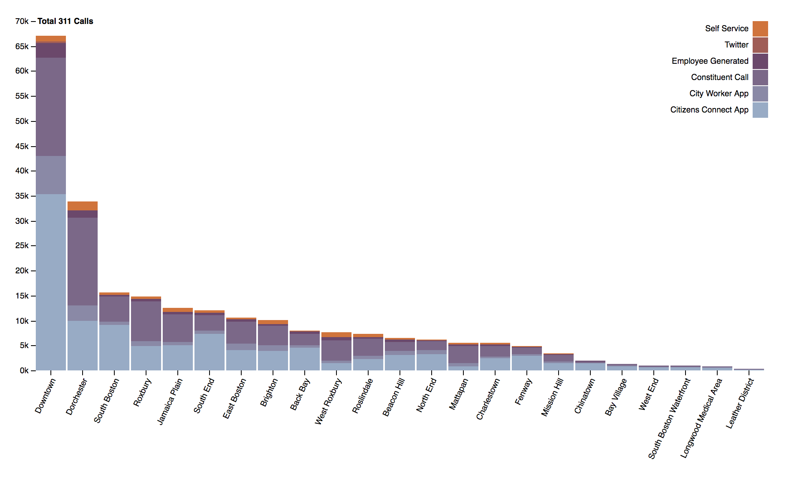
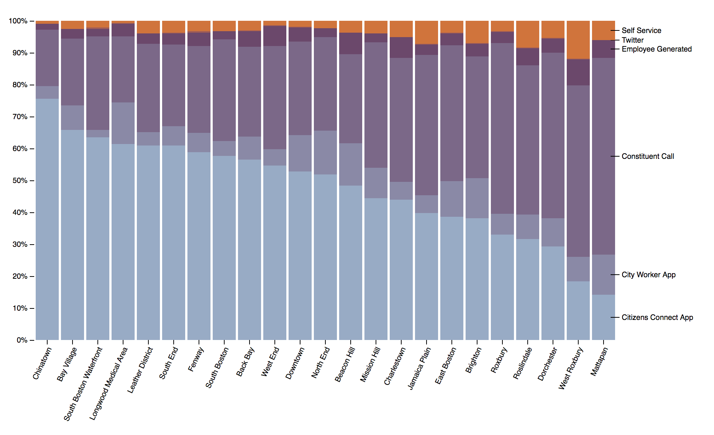

# PSet 6: Working with `d3.js`: Charts

For the PSET this week, we are going to create two `d3.js` graphics using data on 311 requests made in the year 2017. The two graphics will be a stacked bar chart and a normalized stacked bar chart, respectively; these will display the proportion of 311 service requests by neighborhood broken down by request source (e.g., Twitter, the Citizens Connect App).

For purposes of citation, the data you'll be working with is provided by BOS:311 and downloaded from [Analyze Boston](https://data.boston.gov/dataset/311-service-requests).

## Deliverables

The following three graphics should be included in two places:

1. Place HTML files containing these visualizations on your Github pages site.
2. Place your HTML files in week 9's `submission` folder in your forked class repo.
3. Include Please remember to submit to Stellar so that we know you've completed the assignment.

## Part 1: Stacked Bar Charts of 311 Sources

First, you will develop a [Stacked Bar Chart](https://bl.ocks.org/ericmhuntley/56244534d1dc3500692820a1d23cdbd0) that displays the total number of 311 calls in each Boston neighborhood, broken down by the source of the call. In other words, recreate the following bar chart:

The data you need for this exercise is in the data folder. To complete the exercise, you will need data stored in `neigh_311.csv`.

You can use some liberty with your design, but should at least include the following:

1. All included Boston neighborhoods.
2. Show the data in a **Stacked Bar Chart** with the height of each neighborhood bar representing the number of 311 calls and each stacked bar representing the number of calls received from a given source.
3. Add source information, a legend, and a title.

## Part 2: Normalized Stacked Bar Charts of 311 Sources

Next, you will develop a [Normalized Stacked Bar Chart](https://bl.ocks.org/ericmhuntley/57d32aaee59f1c00c77d83d66964509e). This will be very similar to the previous chart, but will display each source as a percentage of total calls rather than as a raw count. In other words, you should include at least the following:

1. All included Boston neighborhoods.
2. The data represented as a **Normalized Stacked Bar Chart** with each stacked bar representing the percentage of calls received from a given source.
3. Add source information, a legend, and a title.

Your final chart should look much like the following:

