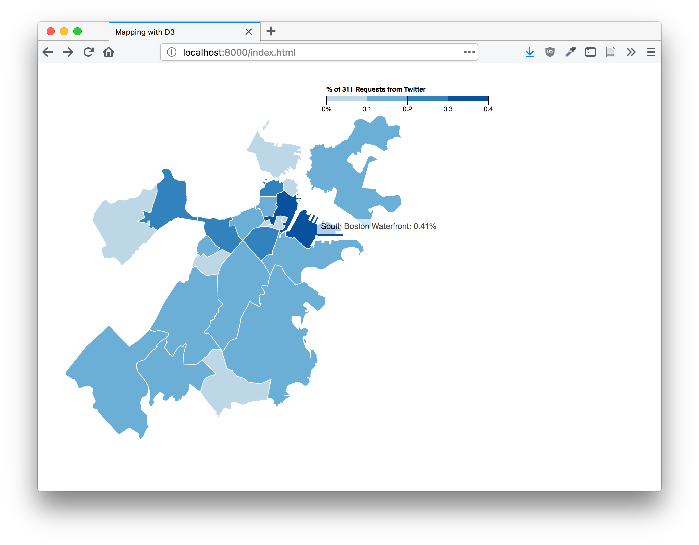
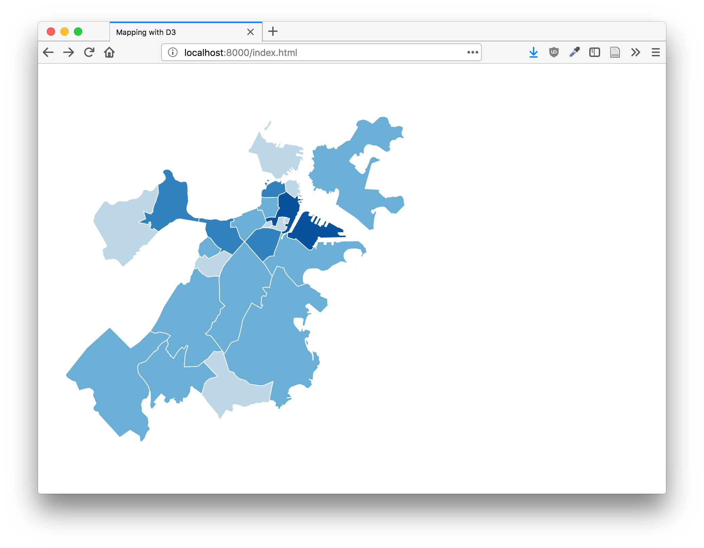
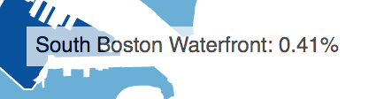
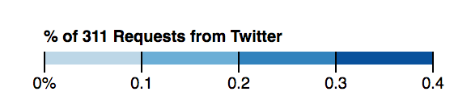

# Problem Set 7: Choropleth Mapping in D3

In this problem set, we'll be building a choropleth map of the percentage of 311 requests made through Twitter by Boston neighborhood. The map will also include a legend and an interactive tooltip. You should be able to use much of the code from our in-class workshops on [choropleth mapping](http://duspviz.mit.edu/d3-workshop/mapping-data-with-d3/) and [barcharts](https://github.com/ericmhuntley/big-data-spring2018/blob/master/week-08/08_intro-to-d3.md) - the latter will be useful when you're producing a tooltip!

### Deliverables

You should include three `.html` files in your week-10 `submission` folder. The first should be the choropleth map with no legend or tooltip, the second should add a tooltip, the third should add the legend. In other words, each should build on the previous. These should be called `part1-complete.html`, `part2-complete.html`, and `part3-complete.html`, respectively.

### Due Date

Wednesday, April 25th @ 6pm

## Part 1: Produce a Choropleth Map (10 points)

In Part 1 of this problem set, you will produce a choropleth map of Boston Neighborhoods, which are shaded according to the percentage of 311 requests that are made using Twitter. You'll need to use the provided `boston_neigh.json` TopoJSON file and the provided `boston_311_totals.csv` file.

Your map should:

+ Use `d3.schemeBlues[5]` from `d3-scale-chromatic.js` to set colors.
+ Be projected using `d3.geoAlbers()`.
+ The enter extent of Boston should be visible - careful that you don't crop any neighborhoods!

## Part 2: Add a Tooltip (5 points)

Now we'll want to add some rudimentary user interaction; if we're a user, we might be interested in the specific percentage of Twitter reporting associated with a given neighborhood. Let's add a tooltip that will display the name of the neighborhood and its percentage when a user mouses over its geometry!

You'll want to reference our earlier [D3 tutorial explaining how to create tooltips](http://duspviz.mit.edu/d3-workshop/intro-to-d3/) - this is a great example of D3's malleability. You can take a chunk of code developed for a different graphic and deploy it in the context of a different visualization by replacing only a few variable names!

Your tooltip should:

+ Have a white background color.
+ Have 5 pixels of padding around the text.
+ Be 70% opaque.

All three of these properties should be set using `.style()` methods! You should also display only two decimal places of any given numeric value. JavaScript's [`.ToFixed()`](https://www.w3schools.com/jsref/jsref_tofixed.asp) method will be useful here.

## Part 3: Add a Legend (5 points)

This will probably be the trickiest part of this assignment, so budget your time accordingly!

Of course, we also want the user to be able to reference the shading of the neighborhoods against a legend. We can create a legend in D3 as well! It follows a logic similar to every other D3 graphic; we'll be creating rectangles shaded like our geometries and an axis displaying the range to which each rectangle corresponds. You should look to [this example for reference](https://bl.ocks.org/mbostock/4060606); you should be able to copy big chunks of that code and make it work with a few modifications.

Hints: you'll need to play with the legend's width, and possibly your map's height. Also make sure that you're using the chunk of code where the `x` object is defined...
